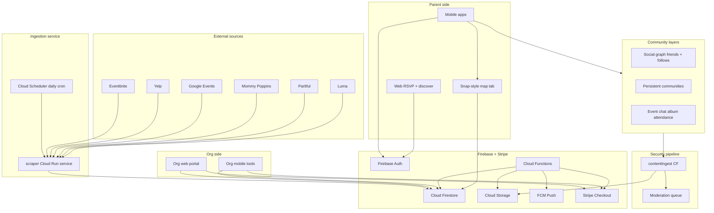
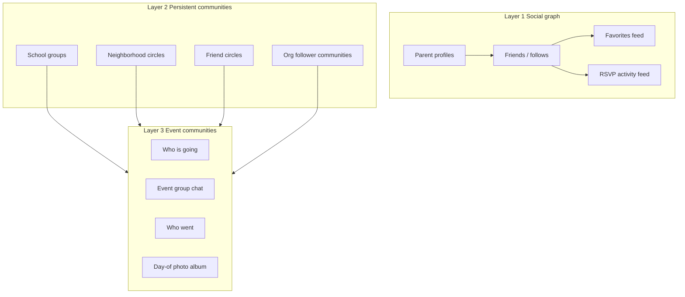
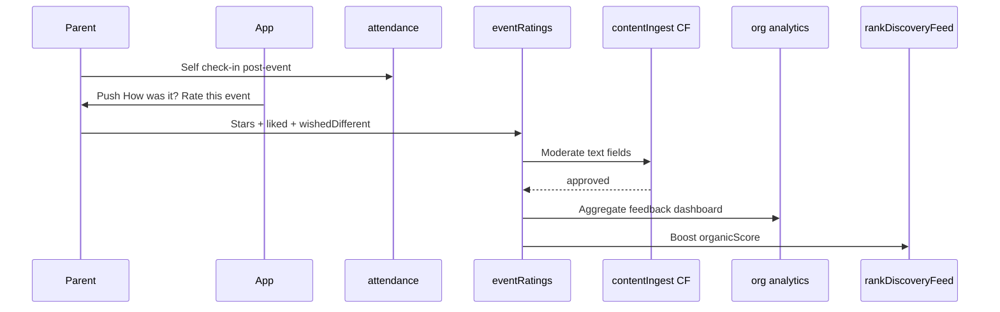
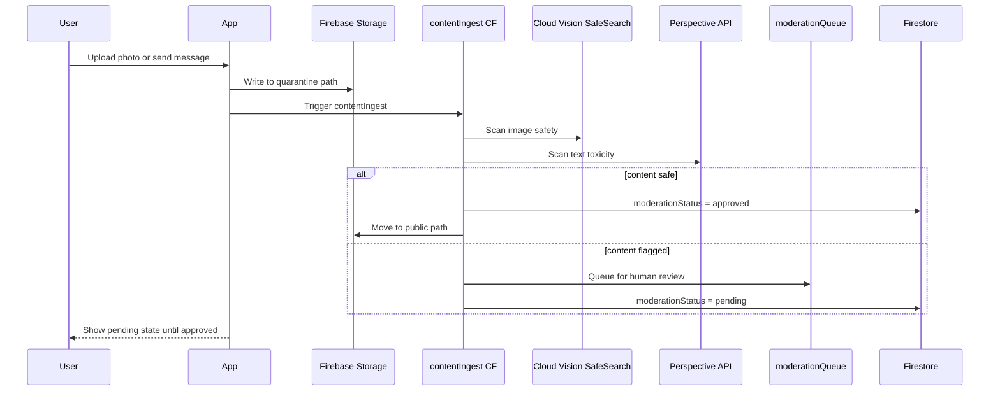

# Recess — Partiful for Kids with Brain Development Edge

> A two-sided marketplace where parents discover kid-friendly events on a Snap Map-style layer — filtered by brain-development goals — rate events after attending, and build community around shared experiences — while schools, organizations, companies, venues, and pop-ups create, manage, and pay to boost event visibility. Recess aggregates events from across the web and keeps every piece of user-generated content behind a security-first moderation pipeline. Firebase backs native Swift, Kotlin, and a Next.js web app. Stripe powers pay-per-boost marketing.

## Product vision

Recess is five things in one:

1. **For parents** — Partiful-style social invites + a Snap Map-style discovery layer to find what's happening near their kids, filtered by brain-development goals
2. **For organizations** — A creator platform where schools, nonprofits, companies, venues, and pop-ups publish events, manage RSVPs, and **pay to boost** visibility in a region
3. **For discovery** — Daily ingestion of kid-relevant events from external platforms so the map is full from day one, even before orgs sign up
4. **For community** — A three-layer social system: parent friend graphs, persistent communities (school, neighborhood, friend circles), and per-event spaces with chat, attendance, and photo albums
5. **For Recess** — Organic relevance (tags, reviews, goals) blended with transparent sponsored placement and security-first UGC moderation

Parents can **share short video reviews** of activities they've tried, and a **calendar drip** surfaces one personalized idea at a time so planning feels light, not overwhelming.



---

## User roles and account types

| Role | Who | Capabilities |
|---|---|---|
| `parent` | Families | Social invites, map browse, reviews, calendar drip, RSVP, community, event chat |
| `org_member` | Staff at a verified org | Create/edit org events, view analytics, purchase boosts, claim external listings |
| `org_admin` | Org owner | Manage members, billing, org profile, verification, org community |
| `guest` | Unauthenticated | Web RSVP, public map browse (read-only) |

**Account model:** One Firebase Auth user can hold multiple hats — a parent account can also be invited as `org_member` on a school account. Store roles in `users/{uid}.roles: ('parent' | 'org_member')[]` and org membership in `organizations/{orgId}/members/{uid}`.

**Community is parent-only:** No child accounts. All social features are parent-to-parent. Child data never appears in public feeds.

---

## Monorepo structure

```
Recess/
├── ingestion/                    # Cloud Run scraper service
│   ├── Dockerfile
│   ├── src/
│   │   ├── adapters/             # Eventbrite, Yelp, Google, etc.
│   │   ├── normalize.ts
│   │   ├── dedupe.ts
│   │   └── kidFilter.ts
│   └── metros/
├── firebase/
│   └── functions/src/
│       ├── suggestTags.ts
│       ├── queryEventsNear.ts
│       ├── rankDiscoveryFeed.ts
│       ├── stripeWebhook.ts
│       ├── ingestWebhook.ts
│       ├── dailyCalendarDrip.ts
│       ├── contentIngest.ts      # UGC security pipeline
│       ├── moderateQueue.ts      # admin review actions
│       ├── onRsvpCreate.ts       # auto-join event chat, system message
│       ├── onEventEnd.ts         # open attendance, close album window
│       └── onRatingWrite.ts      # aggregate ratingsSummary on events + orgs
├── shared/
│   ├── tags.json
│   ├── orgTypes.json
│   ├── boostPackages.json
│   └── schemas/
│       ├── community.ts
│       ├── eventCommunity.ts
│       ├── eventRating.ts
│       └── moderation.ts
├── web/
│   ├── app/e/[slug]/
│   ├── app/discover/
│   ├── app/org/
│   └── app/community/
├── ios/Recess/
│   ├── Features/Map/
│   ├── Features/Org/
│   ├── Features/Parent/
│   └── Features/Community/
├── android/
│   ├── feature/map/
│   ├── feature/org/
│   ├── feature/parent/
│   └── feature/community/
└── PLAN.md
```

The web app is critical for Partiful parity: shareable invite URLs (`recess.app/e/{slug}`) let guests RSVP without installing the app.

---

## Core data model (Firestore)

| Collection | Purpose |
|---|---|
| `users` | Parent profile, roles, social profile, notification prefs |
| `children` | Child name, DOB/age, interests (subcollection of `users/{uid}`) |
| `parentGoals` | Development approach weights (subcollection of `users/{uid}`) |
| `organizations` | Schools, nonprofits, companies, venues, pop-ups |
| `events` | Social, enrichment, org-public, and external events |
| `externalEvents` | Staging collection for ingested events before promotion to `events` |
| `ingestRuns` | Per-metro ingestion job logs and per-source health metrics |
| `promotions` | Pay-per-boost campaigns linked to events |
| `rsvps` | Guest responses (subcollection of `events/{id}`) |
| `eventRatings` | Post-event parent ratings and structured org feedback (subcollection of `events/{id}`) |
| `videoReviews` | Short clips linked to events + optional child age context |
| `calendarIdeas` | Drip suggestions queued per child |
| `savedEvents` | Bookmarked events with optional social feed sharing |
| `communities` | Persistent groups (school, neighborhood, friend circle, org followers) |
| `friendships` | Friend requests and symmetric friend relationships |
| `follows` | Asymmetric follow edges |
| `eventMessages` | Subcollection: `events/{id}/messages/{msgId}` |
| `eventAlbums` | Subcollection: `events/{id}/album/{photoId}` |
| `attendance` | Subcollection: `events/{id}/attendance/{uid}` |
| `moderationQueue` | Flagged content awaiting human review |
| `reports` | User-submitted reports |
| `blocks` | Block list per user |

### Organization types

| `orgType` | Examples |
|---|---|
| `school` | PTA events, school fairs, after-school programs |
| `nonprofit` | Museums, libraries, youth orgs |
| `company` | Kids' brands, retailers hosting workshops |
| `venue` | Trampoline parks, play spaces, theaters |
| `popup` | Farmers market stalls, seasonal activations, mobile experiences |

**Verification (MVP):** Manual admin approval. Public discovery requires `verified`.

### Event document

```typescript
{
  type: "social" | "enrichment" | "org_public" | "external",
  createdBy: {
    creatorType: "parent" | "organization" | "external",
    creatorId: string,
  },
  orgId?: string,
  external?: {
    sourceId: string,
    sourceEventId: string,
    sourceUrl: string,
    sources?: { sourceId: string, sourceUrl: string }[],
    lastIngestedAt: Timestamp,
    claimedByOrgId?: string,
  },
  communitySettings: {
    enabled: boolean,
    whosGoingVisibility: "guests_only" | "friends_of_guests" | "public",
    chatAccess: "rsvp_yes" | "rsvp_all" | "invited_only",
    albumUpload: "attendees" | "host_only",
    albumView: "attendees" | "friends_of_attendees" | "public",
  },
  title: string,
  startsAt: Timestamp,
  endsAt?: Timestamp,
  geo: { lat: number, lng: number, geohash: string },
  location: { name: string, address?: string },
  description: string,
  tags: TagId[],
  tagScores?: Record<TagId, number>,
  ageRange?: { min: number, max: number },
  visibility: "private" | "friends" | "public",
  inviteSlug?: string,
  childIds?: string[],
  capacity?: number,
  isFree: boolean,
  ticketUrl?: string,
  promotion?: {
    isBoosted: boolean,
    boostId?: string,
    label: "Sponsored",
  },
  ratingsSummary?: {
    average: number,
    count: number,
    tagAccuracyAvg?: number,
  },
}
```

**Default `communitySettings` by event type:**

| Event type | `whosGoingVisibility` | `chatAccess` | Community |
|---|---|---|---|
| `social` | `guests_only` | `invited_only` | enabled |
| `enrichment` | `friends_of_guests` | `rsvp_yes` | enabled |
| `org_public` | `public` | `rsvp_all` | enabled |
| `external` | N/A | N/A | disabled |

Host can override any setting. UI shows plain-language privacy summary before publish.

### User profile (extends `users`)

```typescript
{
  profile: {
    displayName: string,
    avatarUrl?: string,
    bio?: string,
    neighborhood?: string,
    profileVisibility: "public" | "friends" | "private",
  },
  social: {
    friendCount: number,
    communityCount: number,
  },
  safety: {
    blockedUsers: string[],
    reportCount: number,
  },
}
```

### Communities document

```typescript
{
  type: "school" | "neighborhood" | "friend_circle" | "org_followers",
  name: string,
  description: string,
  coverImageUrl?: string,
  createdBy: string,
  orgId?: string,
  joinPolicy: "open" | "approval" | "invite_only",
  memberCount: number,
  metroId?: string,
  visibility: "public" | "private",
}
```

### Event messages document

```typescript
{
  authorId: string,
  authorDisplayName: string,
  text: string,
  type: "text" | "system",
  createdAt: Timestamp,
  moderationStatus: "pending" | "approved" | "rejected" | "flagged",
  moderationScore?: number,
}
```

### Event album document

```typescript
{
  uploadedBy: string,
  storagePath: string,
  thumbnailPath: string,
  caption?: string,
  uploadedAt: Timestamp,
  moderationStatus: "pending" | "approved" | "rejected",
  safetyScores: { adult: number, violence: number, racy: number },
}
```

### Saved events (favorites with social layer)

```typescript
{
  eventId: string,
  savedAt: Timestamp,
  shareToFeed: boolean,
  childId?: string,              // private — never shown publicly
}
```

### Event ratings document

Subcollection: `events/{eventId}/eventRatings/{uid}` — one rating per parent per event.

```typescript
{
  authorId: string,
  authorDisplayName: string,
  attendedWithChildAge?: number,
  overallRating: number,
  tagAccuracyRating?: number,
  liked: string,
  wishedDifferent: string,
  highlightTags?: TagId[],
  visibility: "public" | "org_only" | "friends",
  attendanceVerified: boolean,
  moderationStatus: "pending" | "approved" | "rejected",
  createdAt: Timestamp,
  updatedAt: Timestamp,
}
```

**Eligibility:** Parent must have `attendance/{uid}` record or host-confirmed RSVP `yes` within 7 days after `endsAt`. Push notification prompts rating after event ends.

**Aggregates:** `onRatingWrite` Cloud Function recalculates `events.ratingsSummary` and `organizations.ratingsSummary`.

---

## Brain development tag system

### Tag taxonomy (seed in `shared/tags.json`)

| Tag | Examples |
|---|---|
| `stem` | Science museum, coding camp, building blocks |
| `creative_arts` | Painting, music, drama |
| `social_emotional` | Playdates, cooperative games, empathy activities |
| `physical_motor` | Sports, dance, playground, fine-motor crafts |
| `language_literacy` | Story time, journaling, word games |
| `nature_outdoors` | Hikes, gardening, park exploration |
| `sensory` | Sand/water play, textures, calm-down activities |
| `executive_function` | Puzzles, planning games, structured challenges |

### Parent goal profiles (onboarding quiz)

- **Holistic** — balanced weights across all tags
- **STEM Explorer** — high `stem` + `executive_function`
- **Creative Soul** — high `creative_arts` + `sensory`
- **Social Butterfly** — high `social_emotional` + `physical_motor`
- **Custom** — slider per tag (0–100)

### Tag suggestion engine

`firebase/functions/src/suggestTags.ts` — used for event creation, external ingestion, and kid relevance filtering.

---

## Feature modules

### 1. Social events (Partiful parity)

- Create invite with theme, date/time, location, guest list
- Auto-suggest brain-dev tags; configurable community settings
- Shareable web link + deep link into native apps
- RSVP flow: Yes / No / Maybe + optional note
- Web: `/e/[slug]` — public invite + RSVP (no account required for guests)

### 2. Snap Map-style discovery

The **Map tab** is a primary navigation destination.

| Snap Map behavior | Recess equivalent |
|---|---|
| Full-screen map, minimal chrome | Map fills screen; tag/date filters as floating chips |
| Heat / activity clusters | Pin clusters by density; pulse on "happening now" |
| Tap pin → preview card | Bottom sheet: event image, org logo, tags, goal-match badge |
| Friend activity layer | "Friends going" badge on pins (privacy-controlled) |
| Explore stories on map | Phase 4: video review thumbnails as map markers |

**Map filters:** When, Tags, Age, Free/Indoor/Outdoor, Goals, Source ("On Recess" vs "Everywhere")

**Pin types:** native org, external source-branded, claimed external, friends-going indicator

**Ranking:** native org > claimed > high-relevance external > generic external

### 3. External event ingestion

**Strategy:** Scrape everything possible. Use official APIs where they exist to reduce breakage.

**Sources:** Eventbrite, Yelp, Google, Mommy Poppins, Partiful, Luma, Meetup (+ Facebook Phase 2)

**Pipeline:** Cloud Scheduler (daily 3 AM per metro) → Cloud Run (Playwright + Cheerio) → dedupe (fingerprint + fuzzy + cross-source merge) → kid relevance filter → Firestore

**Org claim flow:** Orgs claim ingested listings → upgrade to `org_public` → eligible for boosts

### 4. Organization creator platform

**Web portal (`web/org/`):** onboard, events CRUD, boost purchase, claim external listings, analytics, feedback dashboard, team, settings

**Mobile org tools:** context switcher, quick-create, RSVPs, boost purchase, claim events

### 5. Pay-per-boost marketing

Flat fee per event per region per duration. Packages: Neighborhood ($29/5km/7d), City ($79/25km/7d), Metro ($149/50km/14d).

**Ranking:** `finalScore = organicScore + boostScore + recencyBonus`. `organicScore` includes tag match, `ratingsSummary.average`, RSVP velocity, and age fit. Max 2 sponsored pins per viewport. External events boostable only after org claim.

### 6. Community (three layers)



#### Layer 1 — Social graph

- **Parent profiles** — display name, avatar, bio, neighborhood; default visibility: `friends`
- **Friends** (symmetric, both accept) + **Follow** (asymmetric)
- **Activity feeds** — "Sarah saved Story Time at Brooklyn Library", "James is going to Saturday STEM Fair"
- Child PII never in feeds; activity is parent-attributed only

#### Layer 2 — Persistent communities

| Type | Examples |
|---|---|
| `school` | "PS 321 Parents", "Lincoln Elementary PTA" |
| `neighborhood` | "Park Slope Parents", "Westside LA Families" |
| `friend_circle` | "Maya's preschool friends", "Soccer team parents" |
| `org_followers` | Followers of Brooklyn Children's Museum |

Features: community feed, pinned events, invite links, join approval for school groups, community chat (Phase 4)

#### Layer 3 — Event communities (auto-created)

| Feature | When | Description |
|---|---|---|
| **Who's going** | Pre-event | RSVP list with parent avatars; respects `communitySettings` |
| **Event chat** | On RSVP/invite | Group chat; auto-archived 7 days post-event |
| **Who went** | Post-event | Self or host check-in; builds parent reliability score; unlocks rating prompt |
| **Day-of album** | Event day ± 1 day | Shared photos; all uploads moderated before visible |
| **Event rating** | Post-event (7 days) | Star rating + structured feedback for org; attendance required |

**Who's going:** parent avatar + first name only; "Friends going" badge on map; tap for list + chat shortcut

**Event chat:** Firestore real-time (MVP); system messages; host pin/mute; FCM push; migrate to Stream Chat at scale

**Attendance:** 24h check-in window post-event; `{ checkedInAt, method: "self" | "host" }`

**Photo album:** upload window `startsAt - 1h` to `endsAt + 24h`; multi-photo; gallery in event detail; optional share to community feed

**Favorites feed:** opt-in `shareToFeed` per save; community aggregate "Popular in Park Slope Parents this week"

### 7. Post-event ratings and org feedback

Parents who attended an event can rate it and leave structured feedback for the hosting org — turning every event into a learning loop for organizers and a trust signal for other parents.



#### Rating flow (parent)

1. Event ends → push notification within 2h: *"How was Story Time at Brooklyn Library?"*
2. Parent opens rating sheet (accessible from event detail for 7 days)
3. **Overall rating** — 1–5 stars (required)
4. **Tag accuracy** — "Did the activity match the brain-development tags?" (1–5, optional)
5. **What we liked** — free text, min 20 chars (required)
6. **What we wished was different** — free text, min 20 chars (required); constructive feedback for org
7. **Quick highlights** — optional chips: "Engaging staff", "Great for age group", "Good value", "Well organized", "Would return"
8. **Visibility** — public (default) / friends-only / org-only (private to org, not on public listing)
9. Submit → `contentIngest` moderates text → visible once approved

One rating per parent per event. Editable for 48h after submission.

#### Org feedback dashboard (`web/org/feedback`)

| View | Contents |
|---|---|
| **Event summary** | Average rating, tag accuracy score, rating count, trend vs org average |
| **What parents liked** | Aggregated themes; individual approved quotes |
| **What parents wished was different** | Grouped constructive feedback — primary value for org improvement |
| **Tag accuracy** | Per-tag accuracy scores — helps orgs tag future events better |
| **Rating over time** | Chart per event series / recurring events |
| **Export** | CSV of anonymized feedback for internal review |

Orgs receive weekly digest: top-rated event, lowest-rated event, top feedback theme, suggested improvement.

**Private feedback (`visibility: org_only`):** Visible only to org admins. Still moderated for abuse.

#### Public display and discovery impact

- Event detail: average stars + count ("4.6 · 23 ratings"); tap to read approved public reviews
- Map bottom sheet: star rating badge on pins with 5+ ratings
- Discovery ranking: `organicScore` includes `ratingsSummary.average` (weight 0.15) and credibility boost at 10+ ratings
- Unified "Reviews" tab combines written ratings and video reviews

#### Cross-module integration

- **Attendance required** — prevents ratings from non-attendees
- **External events** — rateable after attending; feedback routes to org once listing is claimed
- **Calendar drip** — prefers events with rating ≥ 4.0 and tag accuracy ≥ 4.0
- **Boost ROI** — org analytics shows rating before vs after boost campaign

### 8. Security-first UGC pipeline

All user-generated content (chat, photos, avatars) passes through `contentIngest` before becoming visible. Nothing goes live on trust alone.



| Content type | Checks |
|---|---|
| **Photos** | Cloud Vision SafeSearch; child-face flagging; EXIF strip |
| **Chat text** | Perspective API toxicity; profanity blocklist; PII auto-redact |
| **Rating feedback text** | Same as chat text; `liked` + `wishedDifferent` scanned before publish |
| **Avatars** | Same image pipeline; initials default until approved |
| **Display names** | Profanity filter; impersonation check |

**Thresholds:** auto-approve < 0.3; auto-reject > 0.7; gray zone → human review within 24h

**Quarantine storage:**
```
storage/
├── quarantine/{uid}/{uploadId}     # write-only by user, read by CF only
├── approved/events/{eventId}/album/{photoId}
├── approved/avatars/{uid}
└── rejected/...                    # retained 30 days for appeals
```

**Report, block, ban:**
- Report any message, photo, profile, or event → priority queue for child-safety keywords
- Block user → hides all their content from blocker's feeds, chats, RSVP lists
- Ban (admin) → disables auth platform-wide
- Rate limits: 20 messages/hour, 10 photo uploads/event

**COPPA and child safety:**
- No child accounts; parent auth required for all community features
- Child data never in public feeds
- Child-face detection flags album photos for review
- Parental control: disable community features account-wide

### 9. Enrichment discovery

- Native + org + ingested events by tag filters and map
- Star ratings and review count on listings; filter by rating ≥ 4
- "Matches [Child]'s goals" badge; save/bookmark; add to calendar drip

### 10. Video reviews

- 30–90 second clips; works on native AND external events
- Complements written ratings in unified "Reviews" tab on event detail
- Stored in Firebase Storage; thumbnail generation; map markers Phase 4

### 11. Calendar trickle

- Nightly `dailyCalendarDrip`; sources: templates + org events + ingested external + reviewed events + community favorites
- External cards: "Found for you on Mommy Poppins" with outbound CTA

---

## Platform-specific notes

### iOS (`ios/`)
- SwiftUI + MVVM; MapKit; AVFoundation; Community feature module
- Stripe Payment Sheet for org boosts

### Android (`android/`)
- Jetpack Compose; Google Maps SDK; CameraX; Community feature module
- Stripe Payment Sheet for org boosts

### Web (`web/`)
- Next.js 15; org portal; community browse (Phase 3); Stripe Checkout

### Ingestion (`ingestion/`)
- Node.js + Playwright + Cheerio on Cloud Run; daily per metro

### Shared contracts (`shared/`)
- Tag taxonomy, org types, boost packages, community/moderation schemas

---

## Security (Firestore rules)

- `users`, `children`, `parentGoals`: read/write by owning `uid`
- `organizations` + members: role-based access
- `events`: host/org write; visibility-based read; `communitySettings` enforced in rules
- `externalEvents`, `ingestRuns`: ingestion service account write only
- `promotions`: Cloud Functions write only (post-Stripe webhook)
- `rsvps`: own RSVP write; host read all; visibility per `communitySettings.whosGoingVisibility`
- `eventMessages`: write by chat participants; read if approved moderation status
- `eventAlbums`: write by upload-eligible users; read if approved
- `attendance`: self check-in or host write
- `eventRatings`: one write per uid per event; attendance or verified RSVP required; public ratings readable on public events; org admins read org_only ratings for their events
- `communities` + members: join-policy enforced
- `friendships`, `follows`: participant read/write
- `moderationQueue`, `reports`: reporter create; admin read/write
- `blocks`: owning user read/write
- `videoReviews`: authenticated write; public read if event public
- `calendarIdeas`: parent uid only

Storage: quarantine write by user; approved paths read by authenticated users; videos max 50MB.

---

## Phased delivery

### Phase 1 — Foundation + parent social + community schema
- Firebase, auth, monorepo scaffold
- Parent onboarding, child profile, goal quiz
- Social invites, web RSVP, geohash on events
- `communitySettings` schema; parent profiles; private favorites
- `friendships` collection; `externalEvents` + `ingestRuns` schema

### Phase 2 — Organizations + Snap Map + event community core
- Org platform, verification, Snap Map tab
- Eventbrite + Yelp ingestion; external pins on map
- **Who's going** RSVP list with configurable visibility
- **Event group chat** (Firestore real-time)
- `contentIngest` text pipeline; report/block flows
- `queryEventsNear` + basic organic ranking

### Phase 3 — Full ingestion + boosts + community expansion
- Google, Mommy Poppins, Partiful, Luma adapters; dedupe; org claim
- Stripe boosts; org analytics; calendar drip
- **Persistent communities** (school, neighborhood, friend circle)
- **Favorites activity feed**; **friends-going map layer**
- **Photo album** + image moderation pipeline
- Favorites feed; community web browse
- **Post-event ratings** + org feedback dashboard (attendance-gated)

### Phase 4 — Video reviews + community polish
- Video reviews + map markers; unified Reviews tab with written ratings
- **Attendance check-in**; org follower communities; community feeds
- Admin moderation dashboard; Stream Chat migration if needed
- Gemini tag suggestions; expand ingestion metros
- Recurring event templates; partnership API migrations

---

## Key technical decisions

| Decision | Choice | Rationale |
|---|---|---|
| Backend | Firebase | Auth, real-time, storage, push, geo |
| Community model | Three layers (graph + persistent + event) | Matches full social + event-centric vision |
| Event privacy | Configurable per event by host | Parents control who's going visibility and chat access |
| UGC moderation | `contentIngest` gate — quarantine first | Security top priority; nothing live without scan |
| Image moderation | Cloud Vision SafeSearch + child-face flag | Photos held pending until approved |
| Text moderation | Perspective API + PII redaction | Chat messages scanned before delivery |
| Event chat MVP | Firestore real-time | Ship fast; migrate to Stream Chat at 10k DAU |
| Event ingestion | Cloud Run + Playwright daily scrape | Maximum coverage |
| Payments | Stripe Checkout + Payment Sheet | Pay-per-boost for orgs |
| Map UX | Custom annotations on native maps | Snap feel from UX, not custom tiles |
| Mobile | Native Swift + Kotlin | iOS and Android |
| Event ratings | Attendance-gated; structured liked/wishedDifferent | Trust signal for parents; actionable feedback loop for orgs |
| Rating visibility | Configurable public / friends / org-only | Parents control candor; orgs still receive private feedback |
| Rating moderation | Same `contentIngest` pipeline as chat | Consistent security for all UGC text |

---

## Implementation todos

- [ ] Initialize Firebase project, Firestore schema, security rules, and Cloud Functions scaffold
- [ ] Define tag taxonomy, org types, boost packages, and community/moderation schemas in `shared/`
- [ ] Scaffold monorepo: `firebase/`, `shared/`, `ingestion/`, `web/`, `ios/`, `android/`
- [ ] Build parent auth + child profile + goal quiz flow on iOS, Android, and web
- [ ] Implement event creation with tag suggestion CF, `communitySettings`, Firestore CRUD, web RSVP
- [ ] Add `organizations`, `promotions`, geohash, role-based auth to Firestore schema + rules
- [ ] Add `externalEvents`, `ingestRuns`, and `external` creator type to schema + rules
- [ ] Add `communities`, `friendships`, `follows`, `eventMessages`, `eventAlbums`, `attendance`, `moderationQueue`, `reports`, `blocks` to schema + rules
- [ ] Build parent profiles, friend request/follow flow, and privacy controls on all platforms
- [ ] Build Cloud Run ingestion service with adapters for Eventbrite, Yelp, Google, Mommy Poppins, Partiful, Luma
- [ ] Build deduplication pipeline and kid relevance filter; wire daily Cloud Scheduler cron
- [ ] Build org onboarding, verification, event CRUD, team management, and claim flow
- [ ] Implement Snap Map: clustering, filters, external pins, friends-going layer, `queryEventsNear` CF
- [ ] Build Who's going RSVP list with configurable per-event visibility
- [ ] Build event group chat with Firestore real-time, system messages, FCM push, auto-archive
- [ ] Build `contentIngest` CF: Perspective text filter, Vision image scan, quarantine storage, rate limits
- [ ] Build report, block, ban flows and `moderationQueue` admin review UI
- [ ] Build day-of photo album with moderation pending states and post-event attendance check-in
- [ ] Build post-event rating flow: stars, tag accuracy, liked/wishedDifferent, highlight tags, visibility controls
- [ ] Build `onRatingWrite` CF to aggregate `ratingsSummary` on events and organizations
- [ ] Build org feedback dashboard: event summaries, liked/wished themes, tag accuracy, weekly digest email
- [ ] Build persistent communities: create, join, invite, community feed
- [ ] Build favorites activity feed with opt-in `shareToFeed`
- [ ] Implement `rankDiscoveryFeed` with organic scoring + sponsored slot cap
- [ ] Integrate Stripe pay-per-boost (Checkout web, Payment Sheet mobile, webhook CF)
- [ ] Build org analytics dashboard and ingestion health dashboard
- [ ] Build `dailyCalendarDrip` Cloud Function, calendar UI, and FCM notifications
- [ ] Implement video record/upload, thumbnail CF, review playback feed

---

## Prerequisites before implementation

1. Create Firebase project (or provide existing project ID)
2. Create Stripe account and configure webhook endpoint
3. Apple Developer + Google Play accounts
4. Google Maps / Mapbox API keys
5. Domain for web invite links (e.g. `recess.app`)
6. Google Cloud project with Cloud Run + Cloud Scheduler enabled
7. Eventbrite / Yelp API keys where available
8. Google Cloud Vision + Perspective API enabled (UGC moderation)
9. Startup legal counsel review of aggregation/scraping AND community/COPPA compliance before launch

---

## Risks and mitigations

- **Three native codebases = slower iteration** — ship web RSVP + one mobile platform first; shared schema keeps clients in sync
- **Pay-to-win perception** — label "Sponsored", cap boosted slots, show goal-match score
- **Org spam / low-quality events** — verification gate; parent reporting
- **Geo query cost at scale** — geohash bounding box; paginate by viewport
- **Scraper breakage / legal exposure** — attribution, link-out, robots.txt audit, DMCA takedown, kill switches, counsel review
- **Low-quality ingested listings** — kid relevance filter + admin queue
- **COPPA exposure** — no child accounts; minimal child PII; legal review before community launch; parental controls
- **Chat moderation at scale** — Firestore MVP; Stream Chat migration at 10k DAU
- **Child faces in photos** — flag-not-block default; community guidelines; fast human review SLA
- **RSVP stalking / harassment** — block hides all interaction; no home addresses in profiles
- **Moderation latency** — gray-zone content pending; set user expectation ("usually within an hour")
- **Album abuse** — upload limits; auto-ban on 3 rejected uploads
- **Video storage costs** — 90s max; compress on upload
- **Calendar drip fatigue** — default 3–4 ideas/week; user-configurable cadence
- **Cloud Run cost** — daily per metro, not continuous; start with 3 metros
- **Rating gaming** — attendance gate + one rating per parent + moderation; orgs cannot rate own events
- **Negative feedback retaliation** — org-only visibility option; orgs cannot see rater identity on org_only feedback
- **Low rating volume early** — show "New" badge instead of stars until 5 ratings; don't penalize new orgs in ranking
