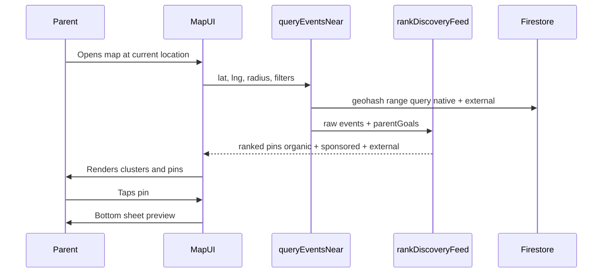
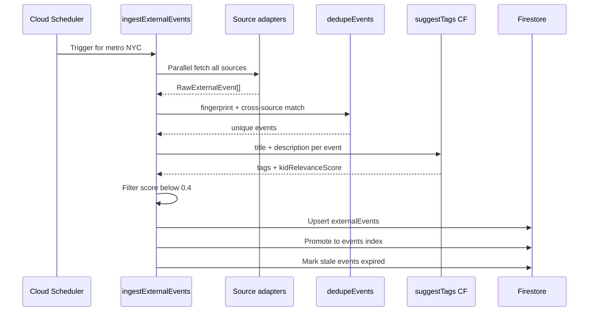
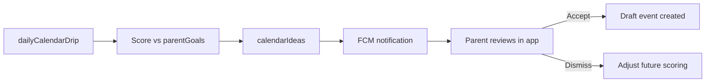

# Recess — Partiful for Kids with Brain Development Edge

> A two-sided marketplace where parents discover kid-friendly events on a Snap Map-style layer — filtered by brain-development goals — while schools, organizations, companies, venues, and pop-ups create, manage, and pay to boost event visibility. Recess also aggregates kid events from across the web (Eventbrite, Yelp, Google, Mommy Poppins, Partiful, Luma, and more) via daily ingestion. Firebase backs native Swift, Kotlin, and a Next.js web app. Stripe powers pay-per-boost marketing.

## Product vision

Recess is four things in one:

1. **For parents** — Partiful-style social invites + a Snap Map-style discovery layer to find what's happening near their kids, filtered by brain-development goals
2. **For organizations** — A creator platform where schools, nonprofits, companies, venues, and pop-ups publish events, manage RSVPs, and **pay to boost** visibility in a region
3. **For discovery** — Daily ingestion of kid-relevant events from external platforms so the map is full from day one, even before orgs sign up
4. **For Recess** — Organic relevance (tags, reviews, goals) blended with transparent sponsored placement

Parents can **share short video reviews** of activities they've tried, and a **calendar drip** surfaces one personalized idea at a time so planning feels light, not overwhelming.

```mermaid
flowchart TB
    subgraph sources [External sources]
        Eventbrite
        Yelp
        GoogleEvents[Google Events]
        MommyPoppins[Mommy Poppins]
        Partiful
        Luma
    end

    subgraph consumers [Parent side]
        ParentApp[Mobile apps]
        ParentWeb[Web RSVP + discover]
        SnapMap[Snap-style map tab]
    end

    subgraph creators [Org side]
        OrgWeb[Org web portal]
        OrgMobile[Org mobile tools]
    end

    subgraph ingest [Ingestion service]
        Scheduler[Cloud Scheduler daily cron]
        ScraperSvc[scraper Cloud Run service]
    end

    subgraph platform [Firebase + Stripe]
        Auth[Firebase Auth]
        Firestore[Cloud Firestore]
        Storage[Cloud Storage]
        Functions[Cloud Functions]
        FCM[FCM Push]
        Stripe[Stripe Checkout]
    end

    Scheduler --> ScraperSvc
    Eventbrite --> ScraperSvc
    Yelp --> ScraperSvc
    GoogleEvents --> ScraperSvc
    MommyPoppins --> ScraperSvc
    Partiful --> ScraperSvc
    Luma --> ScraperSvc
    ScraperSvc --> Firestore
    ParentApp --> SnapMap
    ParentApp --> Auth
    ParentWeb --> Auth
    OrgWeb --> Firestore
    OrgWeb --> Stripe
    OrgMobile --> Firestore
    OrgMobile --> Stripe
    Functions --> Firestore
    Functions --> Storage
    Functions --> FCM
    Functions --> Stripe
    SnapMap --> Firestore
```



---

## User roles and account types

| Role | Who | Capabilities |
|---|---|---|
| `parent` | Families | Social invites, map browse, reviews, calendar drip, RSVP |
| `org_member` | Staff at a verified org | Create/edit org events, view analytics, purchase boosts, claim external listings |
| `org_admin` | Org owner | Manage members, billing, org profile, verification |
| `guest` | Unauthenticated | Web RSVP, public map browse (read-only) |

**Account model:** One Firebase Auth user can hold multiple hats — a parent account can also be invited as `org_member` on a school account. Store roles in `users/{uid}.roles: ('parent' | 'org_member')[]` and org membership in `organizations/{orgId}/members/{uid}`.

---

## Monorepo structure

```
Recess/
├── ingestion/                    # Cloud Run scraper service
│   ├── Dockerfile
│   ├── src/
│   │   ├── index.ts              # HTTP trigger from Scheduler
│   │   ├── orchestrator.ts       # runs adapters per metro
│   │   ├── adapters/
│   │   │   ├── eventbrite.ts
│   │   │   ├── yelp.ts
│   │   │   ├── google.ts
│   │   │   ├── mommyPoppins.ts
│   │   │   ├── partiful.ts
│   │   │   ├── luma.ts
│   │   │   └── base.ts
│   │   ├── normalize.ts
│   │   ├── dedupe.ts
│   │   └── kidFilter.ts
│   └── metros/
│       ├── nyc.json
│       ├── la.json
│       └── chicago.json
├── firebase/
│   └── functions/src/
│       ├── suggestTags.ts
│       ├── queryEventsNear.ts
│       ├── rankDiscoveryFeed.ts
│       ├── stripeWebhook.ts
│       ├── ingestWebhook.ts      # receives Cloud Run completion callback
│       └── dailyCalendarDrip.ts
├── shared/
│   ├── tags.json
│   ├── orgTypes.json
│   ├── boostPackages.json
│   └── schemas/
├── web/
│   ├── app/e/[slug]/
│   ├── app/discover/
│   └── app/org/
├── ios/Recess/
│   ├── Features/Map/
│   ├── Features/Org/
│   └── Features/Parent/
├── android/
│   ├── feature/map/
│   ├── feature/org/
│   └── feature/parent/
└── PLAN.md
```

The web app is critical for Partiful parity: shareable invite URLs (`recess.app/e/{slug}`) let guests RSVP without installing the app.

---

## Core data model (Firestore)

| Collection | Purpose |
|---|---|
| `users` | Parent profile, roles, notification prefs |
| `children` | Child name, DOB/age, interests (subcollection of `users/{uid}`) |
| `parentGoals` | Development approach weights (subcollection of `users/{uid}`) |
| `organizations` | Schools, nonprofits, companies, venues, pop-ups |
| `events` | Social, enrichment, org-public, and external events |
| `externalEvents` | Staging collection for ingested events before promotion to `events` |
| `ingestRuns` | Per-metro ingestion job logs and per-source health metrics |
| `promotions` | Pay-per-boost campaigns linked to events |
| `rsvps` | Guest responses (subcollection of `events/{id}`) |
| `videoReviews` | Short clips linked to events + optional child age context |
| `calendarIdeas` | Drip suggestions queued per child |
| `savedEvents` | Bookmarked enrichment activities |

### Organization types

| `orgType` | Examples |
|---|---|
| `school` | PTA events, school fairs, after-school programs |
| `nonprofit` | Museums, libraries, youth orgs |
| `company` | Kids' brands, retailers hosting workshops |
| `venue` | Trampoline parks, play spaces, theaters |
| `popup` | Farmers market stalls, seasonal activations, mobile experiences |

**Org profile fields:** name, logo, cover image, description, website, verified badge, locations (primary + additional), `orgType`, contact email, social links, `stripeCustomerId`.

**Verification (MVP):** Manual admin approval via Cloud Function + admin flag. Orgs can publish draft events while `verificationStatus: pending`; public discovery requires `verified`. Phase 2: domain/email verification for schools (.edu) and business docs for companies.

### Event document

```typescript
{
  type: "social" | "enrichment" | "org_public" | "external",
  createdBy: {
    creatorType: "parent" | "organization" | "external",
    creatorId: string,
  },
  orgId?: string,
  external?: {
    sourceId: string,
    sourceEventId: string,
    sourceUrl: string,
    sources?: { sourceId: string, sourceUrl: string }[],
    lastIngestedAt: Timestamp,
    claimedByOrgId?: string,
  },
  title: string,
  startsAt: Timestamp,
  endsAt?: Timestamp,
  geo: { lat: number, lng: number, geohash: string },
  location: { name: string, address?: string },
  description: string,
  tags: TagId[],
  tagScores?: Record<TagId, number>,
  ageRange?: { min: number, max: number },
  visibility: "private" | "friends" | "public",
  inviteSlug?: string,
  childIds?: string[],
  capacity?: number,
  isFree: boolean,
  ticketUrl?: string,
  promotion?: {
    isBoosted: boolean,
    boostId?: string,
    label: "Sponsored",
  },
}
```

**Event type split:**
- `social` — parent-created private invites
- `enrichment` — parent-created public activities
- `org_public` — organization-published discoverable events
- `external` — ingested from third-party platforms (Eventbrite, Yelp, etc.)

**Geohash:** Required for all public/org/external events. Computed on write by Cloud Function using `geofire-common`.

### External events staging document

```typescript
{
  sourceId: "eventbrite" | "yelp" | "google" | "mommy_poppins" | "partiful" | "luma" | ...,
  sourceEventId: string,
  sourceUrl: string,
  fingerprint: string,
  title: string,
  description: string,
  startsAt: Timestamp,
  endsAt?: Timestamp,
  geo: { lat, lng, geohash },
  location: { name, address },
  imageUrl?: string,
  isFree?: boolean,
  ticketUrl?: string,
  ageRange?: { min, max },
  tags: TagId[],
  tagScores: Record<TagId, number>,
  kidRelevanceScore: number,
  status: "active" | "expired" | "duplicate" | "rejected",
  lastSeenAt: Timestamp,
  ingestRunId: string,
}
```

### Ingest runs document

```typescript
{
  metroId: string,
  startedAt: Timestamp,
  completedAt: Timestamp,
  perSource: { sourceId, fetched, accepted, rejected, errors }[],
  totalUpserted: number,
  totalExpired: number,
}
```

### Promotions document

```typescript
{
  eventId: string,
  orgId: string,
  status: "pending_payment" | "active" | "expired" | "cancelled",
  package: "neighborhood" | "city" | "metro",
  center: { lat, lng },
  radiusKm: number,
  startsAt: Timestamp,
  endsAt: Timestamp,
  stripePaymentIntentId: string,
  boostWeight: number,
  impressions: number,
  clicks: number,
}
```

---

## Brain development tag system

### Tag taxonomy (seed in `shared/tags.json`)

| Tag | Examples |
|---|---|
| `stem` | Science museum, coding camp, building blocks |
| `creative_arts` | Painting, music, drama |
| `social_emotional` | Playdates, cooperative games, empathy activities |
| `physical_motor` | Sports, dance, playground, fine-motor crafts |
| `language_literacy` | Story time, journaling, word games |
| `nature_outdoors` | Hikes, gardening, park exploration |
| `sensory` | Sand/water play, textures, calm-down activities |
| `executive_function` | Puzzles, planning games, structured challenges |

### Parent goal profiles (onboarding quiz)

Parents pick an approach or customize weights:

- **Holistic** — balanced weights across all tags
- **STEM Explorer** — high `stem` + `executive_function`
- **Creative Soul** — high `creative_arts` + `sensory`
- **Social Butterfly** — high `social_emotional` + `physical_motor`
- **Custom** — slider per tag (0–100)

### Tag suggestion engine (MVP: rule-based Cloud Function)

`firebase/functions/src/suggestTags.ts` — callable function:

**Inputs:** event title/description, event type, child age, `parentGoals` weights  
**Logic (MVP):** keyword matching + age-based boosts + parent goal weighting  
**Output:** ranked tags with scores; creator confirms/edits before publish

Also used by the ingestion pipeline to auto-tag external events and compute `kidRelevanceScore`.

**Phase 2:** Gemini via Firebase AI Logic for richer suggestions from free-text descriptions.

---

## Feature modules

### 1. Social events (Partiful parity)

- Create invite with theme, date/time, location, guest list
- Auto-suggest brain-dev tags from event description
- Generate shareable web link + deep link into native apps
- RSVP flow: Yes / No / Maybe + optional note
- Co-host support (Phase 2)

**Web flows** in `web/`:
- `/e/[slug]` — public invite + RSVP (no account required for guests)

### 2. Snap Map-style discovery

The **Map tab** is a primary navigation destination — not a buried filter.

| Snap Map behavior | Recess equivalent |
|---|---|
| Full-screen map, minimal chrome | Map fills screen; tag/date filters as floating chips |
| Heat / activity clusters | Pin clusters by density; pulse animation on "happening now" |
| Tap pin → preview card | Bottom sheet: event image, org logo, tags, "Matches Maya's goals" badge |
| Friend activity layer | Phase 2: "Friends going" dots on map (privacy-controlled) |
| Explore stories on map | Phase 2: video review thumbnails as map markers |

**Map tech stack:**

| Layer | Choice |
|---|---|
| iOS | MapKit + custom annotation views (SwiftUI) |
| Android | Google Maps SDK + custom markers (Compose) |
| Web discover | Mapbox GL or Google Maps JS |
| Geo queries | Firestore `geohash` + Cloud Function `queryEventsNear` |

**Map filters (floating chips):**
- **When:** Today / This weekend / Custom range
- **Tags:** Brain-dev tags
- **Age:** Matches child profile
- **Type:** Free only, Indoor/Outdoor
- **Goals:** "For Maya" toggle — boosts events matching `parentGoals`
- **Source:** "On Recess" vs **"Everywhere"** (default: everywhere — includes ingested events)

**Pin types:**
- Native org events: org logo pin, boost glow if sponsored
- External events: smaller source-branded icon (Eventbrite, Yelp, etc.)
- Claimed external events: upgrade to full org pin with boost eligibility

**Ranking:** native org events > claimed events > high-relevance external > generic external

**External event UX:**
- Label: "Found on [Source]" — never presented as a Recess-hosted event
- Bottom sheet CTA: **"View on Eventbrite"** (opens `sourceUrl`) — no in-app RSVP for external events at launch
- Recess video reviews still attach to external events (unique value-add)



### 3. External event ingestion

**Strategy:** Scrape everything possible for maximum coverage. Use official APIs where they exist to reduce breakage, but do not limit sources to API-only platforms.

**Why:** The map feels empty without density. Parents expect to see everything happening for kids nearby — not just events created on Recess. Ingested events seed the map on day one, power calendar drip, and give orgs a reason to claim their listing.

#### Source adapters

Each platform gets a pluggable adapter in `ingestion/src/adapters/`:

| Source | Fetch method | Kid-filter strategy |
|---|---|---|
| **Eventbrite** | API + search fallback | Category: family, kids, education; keywords: children, toddler, STEM |
| **Yelp** | Fusion API + scrape fallback | Events endpoint + kids activities, playgrounds, museums |
| **Google** | Scrape Google Events / Maps | "kids events", "family activities" queries per metro |
| **Mommy Poppins** | Site scrape | City landing pages, calendar sections |
| **Partiful** | Scrape public invite pages | Public event index; family/kids keyword filter |
| **Luma** | Scrape public calendars | Public community calendars; keyword filter |
| **Meetup** | API | Family/parenting groups |
| **Facebook Events** | Graph API if available, else skip | Phase 2 — auth complexity |

```typescript
interface SourceAdapter {
  sourceId: string;
  fetch(metro: MetroConfig): Promise<RawExternalEvent[]>;
  parse(raw: unknown): RawExternalEvent;
}
```

**Metro-based crawling:** Runs per configured metro (NYC, LA, Chicago to start). Expand by adding metro configs, not code changes.

#### Daily pipeline

- **Cloud Scheduler** triggers ingestion daily at 3 AM local per metro
- **Cloud Run** service (Node.js + Playwright + Cheerio) runs all adapters in parallel
- Stale events not seen in 2 consecutive runs → `status: expired`



#### Deduplication (three passes)

1. **Exact fingerprint** — `hash(normalize(title) + date + round(lat,3) + round(lng,3))`
2. **Fuzzy match** — Levenshtein title similarity > 0.85 + same date + within 200m
3. **Cross-source merge** — keep highest-quality record; store all `sourceUrl`s as alternates

#### Kid relevance filter

- `kidRelevanceScore` from `suggestTags` CF + keyword blocklist/allowlist
- Reject adult-only keywords (nightlife, 21+, etc.)
- Require at least one kid-relevant tag OR keyword hit
- Admin review queue for borderline scores (0.3–0.4)

#### Org claim flow (monetization bridge)

1. Org finds their event on the map (labeled "Found on Eventbrite")
2. Taps **"Claim this event"** → verification flow
3. On approval: `external.claimedByOrgId` set, event upgrades to `type: org_public`
4. Org can edit details, respond to reviews, and **purchase boosts**
5. External `sourceUrl` remains as secondary link

### 4. Organization creator platform

**Web portal (`web/org/`):**
- `/org/onboard` — create org, submit verification
- `/org/events` — CRUD events, duplicate recurring events
- `/org/events/[id]/boost` — purchase boost package (Stripe Checkout)
- `/org/events/claim` — claim ingested external listings
- `/org/analytics` — impressions, map pin clicks, RSVPs, review count
- `/org/team` — invite members, assign admin/editor roles
- `/org/settings` — profile, locations, billing history

**Mobile org tools (iOS + Android):**
- Switch account context: "Posting as Lincoln Elementary PTA"
- Quick-create event with photo, location pin, tags
- View today's RSVPs and check-in count
- Purchase boost (Stripe Payment Sheet)
- Claim external events

### 5. Pay-per-boost marketing

Orgs pay a **flat fee per event per region per duration**. No credits wallet at launch.

**Boost packages (example pricing — tune later):**

| Package | Reach | Duration | Price |
|---|---|---|---|
| Neighborhood | 5 km radius | 7 days | $29 |
| City | 25 km radius | 7 days | $79 |
| Metro | 50 km radius | 14 days | $149 |

**Ranking algorithm (`rankDiscoveryFeed`):**

```
finalScore = organicScore + boostScore + recencyBonus
```

- **organicScore** — tag match to parent goals, review rating, RSVP velocity, age fit
- **boostScore** — `boostWeight` if user is within promotion radius and `status === active`; else 0
- **recencyBonus** — events starting within 48h get a small bump

**Transparency rules:**
- Boosted events always carry `promotion.label: "Sponsored"`
- Cap sponsored slots: max 2 sponsored pins per map viewport
- External events cannot be boosted until claimed by a verified org

### 6. Enrichment discovery

- Curated + user-created + org-published + ingested events surfaced by tag filters and map
- "Matches [Child]'s goals" badge when tag overlap exceeds threshold
- Save/bookmark for later; one-tap "Add to calendar drip"

### 7. Video reviews

- Record or upload **30–90 second** clips post-event
- Stored in Firebase Storage: `reviews/{eventId}/{reviewId}.mp4`
- Works on native AND external events (unique value-add over source platforms)
- Cloud Function generates thumbnail on upload
- Playback in event detail + discovery feed + map markers (Phase 2)

### 8. Calendar trickle

**Concept:** One idea per day/week per child based on goals, age, location, and season.

**Implementation:**
- Scheduled Cloud Function (`dailyCalendarDrip`) runs nightly
- Picks from: template library + org public events + ingested external events + highly-reviewed events
- Scores candidates against `parentGoals` + child age band + proximity
- External event cards: "Found for you on Mommy Poppins" with "Book on [Source]" CTA
- Writes to `calendarIdeas` with `status: pending | accepted | dismissed`



---

## Platform-specific notes

### iOS (`ios/`)
- SwiftUI + MVVM
- Firebase iOS SDK (Auth, Firestore, Storage)
- MapKit + custom annotations for Snap Map (native, external, source-branded pins)
- `AVFoundation` for in-app video recording
- Sign in with Apple + Google
- Stripe Payment Sheet for org boosts

### Android (`android/`)
- Jetpack Compose + ViewModel
- Firebase Android SDK
- Google Maps SDK + custom markers
- CameraX for video capture
- Google Sign-In
- Stripe Payment Sheet for org boosts

### Web (`web/`)
- Next.js 15 App Router
- Firebase JS SDK (client) for auth + Firestore reads
- Server components for SEO-friendly invite pages
- Org portal for billing, analytics, event management, and claim flow
- Stripe Checkout for boost purchases

### Ingestion (`ingestion/`)
- Node.js + Playwright (headless browser) + Cheerio (static HTML)
- Cloud Run with browser binaries in Docker image
- Per-adapter rate limiting, rotating user agents, exponential backoff
- Per-source health metrics written to `ingestRuns`

### Shared contracts (`shared/`)
- Tag taxonomy, org types, boost packages JSON
- TypeScript types exported for web; Swift/Kotlin stubs aligned on field names and enums

---

## Security (Firestore rules)

- `users`, `children`, `parentGoals`: read/write only by owning `uid`
- `organizations`: readable if `verified` or member; writable by `org_admin`
- `organizations/{orgId}/members`: readable by members; writable by `org_admin`
- `events`: host/org member can write; readable based on `visibility`
- `events` with `creatorType: organization`: writable by org members with `editor`+ role
- `externalEvents`: read by authenticated users; write only by ingestion service account
- `ingestRuns`: read by admin; write only by ingestion service account
- `promotions`: readable by owning org; writable only by Cloud Functions (post-Stripe webhook)
- `rsvps`: guests can create their own; host can read all
- `videoReviews`: authenticated write; public read if linked event is public
- `calendarIdeas`: read/write only by parent `uid`
- Map queries: public read on `visibility: public` events (includes `org_public` and `external`)

Storage rules: video uploads limited to authenticated users, max 50MB, path must match `reviews/{eventId}/`.

---

## Phased delivery

### Phase 1 — Foundation + parent social
- Firebase project init, Auth, Firestore, Storage, Functions
- Monorepo scaffold (all targets including `ingestion/`)
- Parent onboarding: account, child profile, goal quiz
- Create social event with tag suggestions
- Web RSVP page at `/e/[slug]`
- Basic iOS + Android: auth, create event, view RSVPs
- Geohash on all events; `externalEvents` + `ingestRuns` schema; manual seed data

### Phase 2 — Organizations + Snap Map + initial ingestion
- `organizations` collection, verification flow, org web portal
- Org event creation (web + mobile)
- Snap Map tab with clustering, filters, bottom-sheet previews
- `queryEventsNear` + basic organic ranking
- Web `/discover` map browse
- Eventbrite + Yelp adapters; daily cron for 1 launch metro; external pins on map

### Phase 3 — Full ingestion + pay-per-boost + calendar drip
- Google, Mommy Poppins, Partiful, Luma adapters
- Cross-source deduplication; kid relevance filter; stale event expiry
- Org "Claim this event" flow
- Stripe integration, boost purchase flow (web + mobile)
- `rankDiscoveryFeed` with sponsored slots + transparency labels
- Org analytics dashboard
- Calendar drip sources from org + ingested external events

### Phase 4 — Video reviews + polish
- Video record/upload + thumbnail generation
- Review feed on event pages and map markers
- "Friends going" map layer
- Gemini-powered tag suggestions
- Expand ingestion metros; admin review queue; adapter health dashboard
- Partnership API migrations (swap scrape adapters for official APIs)

---

## Key technical decisions

| Decision | Choice | Rationale |
|---|---|---|
| Backend | Firebase | Auth, real-time RSVPs, video storage, push, geo queries |
| Web framework | Next.js | SEO invite pages, org portal, shared Firebase SDK |
| Payments | Stripe Checkout + Payment Sheet | Industry standard; works on web and native |
| Monetization | Pay-per-boost (flat fee) | Simple to explain; no wallet complexity at launch |
| Org management | Mobile + web portal | Field staff use mobile; billing/analytics on web |
| Event ingestion | Cloud Run + Playwright daily scrape | Maximum coverage; APIs used where available within scrape-all strategy |
| Ingestion cadence | Once daily per metro | Fresh enough for events; keeps Cloud Run costs manageable |
| Geo index | Firestore geohash | Fits Firebase stack; good enough for city-scale |
| Map UX | Custom annotations on native maps | Snap feel from UX (clusters, pulses, sheets) |
| Sponsored cap | Max 2 per viewport | Keeps map trustworthy; organic goal-match still wins |
| External events | Link-out only until claimed | No fake RSVP; claim flow converts to native org event |
| Tag engine MVP | Rule-based CF | Ship fast; also powers ingestion kid-filter |
| Calendar drip cadence | 1 idea / child / day (configurable) | "Trickle" feel; avoids overwhelm |
| Guest RSVP | Web-only, no account | Partiful-style low friction |
| Mobile | Native Swift + Kotlin | iOS and Android native apps |

---

## Implementation todos

- [ ] Initialize Firebase project, Firestore schema, security rules, and Cloud Functions scaffold
- [ ] Define brain-development tag taxonomy, org types, and boost packages in `shared/`
- [ ] Scaffold monorepo: `firebase/`, `shared/`, `ingestion/`, `web/`, `ios/`, `android/`
- [ ] Build parent auth + child profile + goal quiz flow on iOS, Android, and web
- [ ] Implement event creation with tag suggestion CF, Firestore CRUD, and web RSVP page at `/e/[slug]`
- [ ] Add `organizations`, `promotions`, geohash fields, and role-based auth to Firestore schema + rules
- [ ] Add `externalEvents`, `ingestRuns` collections and `external` creator type to schema + rules
- [ ] Build Cloud Run ingestion service with adapter interface, Playwright/Cheerio, and metro configs
- [ ] Implement source adapters: Eventbrite, Yelp, Google, Mommy Poppins, Partiful, Luma
- [ ] Build deduplication pipeline: fingerprint, fuzzy match, cross-source merge
- [ ] Integrate kid relevance filter with `suggestTags` CF; reject sub-threshold events
- [ ] Wire Cloud Scheduler daily cron per metro; stale event expiry after 2 missed runs
- [ ] Build org onboarding, verification, event CRUD, team management, and claim flow
- [ ] Implement Snap Map tab: clustering, filters, external pins, bottom-sheet previews, `queryEventsNear` CF
- [ ] Implement `rankDiscoveryFeed` with organic scoring + sponsored slot cap
- [ ] Integrate Stripe pay-per-boost (Checkout web, Payment Sheet mobile, webhook CF)
- [ ] Build org analytics dashboard: impressions, pin clicks, RSVPs, boost ROI per event
- [ ] Build `dailyCalendarDrip` Cloud Function, calendar UI, and FCM notifications
- [ ] Implement video record/upload, thumbnail CF, review playback feed, and Storage security rules
- [ ] Add ingestion health dashboard for admin (per-source success rates, errors)

---

## Prerequisites before implementation

1. Create Firebase project (or provide existing project ID)
2. Create Stripe account and configure webhook endpoint
3. Apple Developer + Google Play accounts (for native auth providers)
4. Google Maps / Mapbox API keys for map features
5. Domain for web invite links (e.g. `recess.app` or staging subdomain)
6. Google Cloud project with Cloud Run + Cloud Scheduler enabled (for ingestion service)
7. Eventbrite / Yelp API keys where available (supplements scraping)
8. Startup legal counsel review of aggregation/scraping approach before ingestion launch

---

## Risks and mitigations

- **Three native codebases = slower iteration** — ship web RSVP + one mobile platform first if needed; shared Firestore schema keeps clients in sync
- **Pay-to-win perception** — always label "Sponsored", cap boosted slots per viewport, show goal-match score alongside
- **Org spam / low-quality events** — verification gate before public map; parent reporting flow
- **Geo query cost at scale** — geohash bounding box + client-side distance filter; paginate map loads by viewport
- **Pop-up ephemeral events** — `endsAt` required; auto-expire pins after event ends; "happening now" filter highlights short-lived pop-ups
- **Video storage costs** — enforce 90s max, compress on upload, lazy-load in feeds
- **Tag quality at MVP** — rule-based engine will miss nuance; creator always edits before publish; Gemini upgrade in Phase 4
- **Calendar drip fatigue** — default to 3–4 ideas/week, not daily; let parents tune cadence in settings
- **Stripe + mobile compliance** — org billing web-first at launch; verify App Store / Play billing guidelines for business boost purchases
- **Scraper breakage** — sites change HTML frequently; budget ongoing adapter maintenance; per-source health alerts
- **Legal exposure (scrape-all)** — attribution always, link out to source, robots.txt audit, DMCA takedown process, per-source kill switches, counsel review before launch
- **Low-quality ingested listings** — kid relevance filter + admin review queue; parents can report irrelevant events
- **Duplicate overload** — dedupe must run before map write; merged events show primary source link
- **Cloud Run cost** — Playwright is heavy; run once daily per metro, not continuously; start with 3 metros
