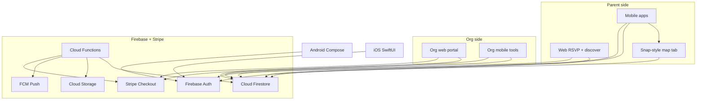
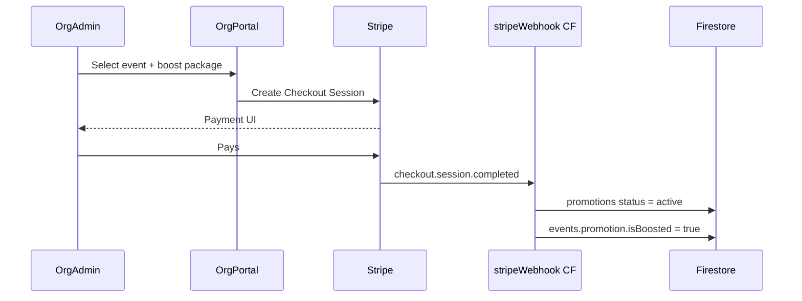
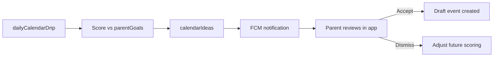

# Recess — Partiful for Kids with Brain Development Edge

> A two-sided marketplace where parents discover kid-friendly events on a Snap Map-style layer — filtered by brain-development goals — while schools, organizations, companies, venues, and pop-ups create, manage, and pay to boost event visibility. Firebase backs native Swift, Kotlin, and a Next.js web app. Stripe powers pay-per-boost marketing.

## Product vision

Recess is three things in one:

1. **For parents** — Partiful-style social invites + a Snap Map-style discovery layer to find what's happening near their kids, filtered by brain-development goals
2. **For organizations** — A creator platform where schools, nonprofits, companies, venues, and pop-ups publish events, manage RSVPs, and **pay to boost** visibility in a region
3. **For Recess** — Organic relevance (tags, reviews, goals) blended with transparent sponsored placement

Parents can **share short video reviews** of activities they've tried, and a **calendar drip** surfaces one personalized idea at a time so planning feels light, not overwhelming.



---

## User roles and account types

| Role | Who | Capabilities |
|---|---|---|
| `parent` | Families | Social invites, map browse, reviews, calendar drip, RSVP |
| `org_member` | Staff at a verified org | Create/edit org events, view analytics, purchase boosts |
| `org_admin` | Org owner | Manage members, billing, org profile, verification |
| `guest` | Unauthenticated | Web RSVP, public map browse (read-only) |

**Account model:** One Firebase Auth user can hold multiple hats — a parent account can also be invited as `org_member` on a school account. Store roles in `users/{uid}.roles: ('parent' | 'org_member')[]` and org membership in `organizations/{orgId}/members/{uid}`.

---

## Monorepo structure

```
Recess/
├── firebase/
│   └── functions/src/
│       ├── suggestTags.ts
│       ├── queryEventsNear.ts      # geohash radius query
│       ├── rankDiscoveryFeed.ts    # organic + boost ranking
│       ├── stripeWebhook.ts
│       └── dailyCalendarDrip.ts
├── shared/
│   ├── tags.json
│   ├── orgTypes.json
│   ├── boostPackages.json
│   └── schemas/
├── web/
│   ├── app/e/[slug]/               # parent RSVP
│   ├── app/discover/               # web map browse
│   └── app/org/                    # org portal
├── ios/Recess/
│   ├── Features/Map/               # Snap-style map tab
│   ├── Features/Org/               # org context + tools
│   └── Features/Parent/            # invites, reviews, drip
├── android/
│   ├── feature/map/
│   ├── feature/org/
│   └── feature/parent/
└── PLAN.md
```

The web app is critical for Partiful parity: shareable invite URLs (`recess.app/e/{slug}`) let guests RSVP without installing the app.

---

## Core data model (Firestore)

| Collection | Purpose |
|---|---|
| `users` | Parent profile, roles, notification prefs |
| `children` | Child name, DOB/age, interests (subcollection of `users/{uid}`) |
| `parentGoals` | Development approach weights (subcollection of `users/{uid}`) |
| `organizations` | Schools, nonprofits, companies, venues, pop-ups |
| `events` | Social, enrichment, and org-public events |
| `promotions` | Pay-per-boost campaigns linked to events |
| `rsvps` | Guest responses (subcollection of `events/{id}`) |
| `videoReviews` | Short clips linked to events + optional child age context |
| `calendarIdeas` | Drip suggestions queued per child |
| `savedEvents` | Bookmarked enrichment activities |

### Organization types

| `orgType` | Examples |
|---|---|
| `school` | PTA events, school fairs, after-school programs |
| `nonprofit` | Museums, libraries, youth orgs |
| `company` | Kids' brands, retailers hosting workshops |
| `venue` | Trampoline parks, play spaces, theaters |
| `popup` | Farmers market stalls, seasonal activations, mobile experiences |

**Org profile fields:** name, logo, cover image, description, website, verified badge, locations (primary + additional), `orgType`, contact email, social links, `stripeCustomerId`.

**Verification (MVP):** Manual admin approval via Cloud Function + admin flag. Orgs can publish draft events while `verificationStatus: pending`; public discovery requires `verified`. Phase 2: domain/email verification for schools (.edu) and business docs for companies.

### Event document

```typescript
{
  type: "social" | "enrichment" | "org_public",
  createdBy: {
    creatorType: "parent" | "organization",
    creatorId: string,        // uid or orgId
  },
  orgId?: string,             // set when creatorType === "organization"
  title: string,
  startsAt: Timestamp,
  endsAt?: Timestamp,
  geo: { lat: number, lng: number, geohash: string },
  location: { name: string, address?: string },
  description: string,
  tags: TagId[],
  tagScores?: Record<TagId, number>,
  ageRange?: { min: number, max: number },
  visibility: "private" | "friends" | "public",
  inviteSlug?: string,       // social events only
  childIds?: string[],
  capacity?: number,
  isFree: boolean,
  ticketUrl?: string,
  promotion?: {
    isBoosted: boolean,
    boostId?: string,
    label: "Sponsored",
  },
}
```

**Event type split:**
- `social` — parent-created private invites
- `enrichment` — parent-created public activities
- `org_public` — organization-published discoverable events (primary map content)

**Geohash:** Required for all public/org events. Computed on write by Cloud Function using `geofire-common` for efficient radius queries.

### Promotions document

```typescript
{
  eventId: string,
  orgId: string,
  status: "pending_payment" | "active" | "expired" | "cancelled",
  package: "neighborhood" | "city" | "metro",
  center: { lat, lng },
  radiusKm: number,
  startsAt: Timestamp,
  endsAt: Timestamp,
  stripePaymentIntentId: string,
  boostWeight: number,
  impressions: number,
  clicks: number,
}
```

---

## Brain development tag system

### Tag taxonomy (seed in `shared/tags.json`)

| Tag | Examples |
|---|---|
| `stem` | Science museum, coding camp, building blocks |
| `creative_arts` | Painting, music, drama |
| `social_emotional` | Playdates, cooperative games, empathy activities |
| `physical_motor` | Sports, dance, playground, fine-motor crafts |
| `language_literacy` | Story time, journaling, word games |
| `nature_outdoors` | Hikes, gardening, park exploration |
| `sensory` | Sand/water play, textures, calm-down activities |
| `executive_function` | Puzzles, planning games, structured challenges |

### Parent goal profiles (onboarding quiz)

Parents pick an approach or customize weights:

- **Holistic** — balanced weights across all tags
- **STEM Explorer** — high `stem` + `executive_function`
- **Creative Soul** — high `creative_arts` + `sensory`
- **Social Butterfly** — high `social_emotional` + `physical_motor`
- **Custom** — slider per tag (0–100)

### Tag suggestion engine (MVP: rule-based Cloud Function)

`firebase/functions/src/suggestTags.ts` — callable function:

**Inputs:** event title/description, event type, child age, `parentGoals` weights  
**Logic (MVP):** keyword matching + age-based boosts + parent goal weighting  
**Output:** ranked tags with scores; creator confirms/edits before publish

**Phase 2:** Gemini via Firebase AI Logic for richer suggestions from free-text descriptions.


---

## Feature modules

### 1. Social events (Partiful parity)

- Create invite with theme, date/time, location, guest list
- Auto-suggest brain-dev tags from event description
- Generate shareable web link + deep link into native apps
- RSVP flow: Yes / No / Maybe + optional note
- Co-host support (Phase 2)

**Web flows** in `web/`:
- `/e/[slug]` — public invite + RSVP (no account required for guests)

### 2. Snap Map-style discovery

The **Map tab** is a primary navigation destination — not a buried filter.

| Snap Map behavior | Recess equivalent |
|---|---|
| Full-screen map, minimal chrome | Map fills screen; tag/date filters as floating chips |
| Heat / activity clusters | Pin clusters by density; pulse animation on "happening now" |
| Tap pin → preview card | Bottom sheet: event image, org logo, tags, "Matches Maya's goals" badge |
| Friend activity layer | Phase 2: "Friends going" dots on map (privacy-controlled) |
| Explore stories on map | Phase 2: video review thumbnails as map markers |

**Map tech stack:**

| Layer | Choice |
|---|---|
| iOS | MapKit + custom annotation views (SwiftUI) |
| Android | Google Maps SDK + custom markers (Compose) |
| Web discover | Mapbox GL or Google Maps JS |
| Geo queries | Firestore `geohash` + Cloud Function `queryEventsNear` |

**Map filters (floating chips):**
- **When:** Today / This weekend / Custom range
- **Tags:** Brain-dev tags
- **Age:** Matches child profile
- **Type:** Free only, Indoor/Outdoor
- **Goals:** "For Maya" toggle — boosts events matching `parentGoals`

**Clustering:**
- Zoomed out: cluster pins with count badge
- Zoomed in: individual pins with org logo or category icon
- Boosted events: slightly larger pin + subtle glow (labeled "Sponsored" in sheet)


### 3. Organization creator platform

**Web portal (`web/org/`):**
- `/org/onboard` — create org, submit verification
- `/org/events` — CRUD events, duplicate recurring events
- `/org/events/[id]/boost` — purchase boost package (Stripe Checkout)
- `/org/analytics` — impressions, map pin clicks, RSVPs, review count
- `/org/team` — invite members, assign admin/editor roles
- `/org/settings` — profile, locations, billing history

**Mobile org tools (iOS + Android):**
- Switch account context: "Posting as Lincoln Elementary PTA"
- Quick-create event with photo, location pin, tags
- View today's RSVPs and check-in count
- Purchase boost (Stripe Payment Sheet)
- Push notification when boost goes live

**Org event creation flow:**
1. Select org context
2. Title, description, photo, date/time
3. Drop pin on map (required for `org_public`)
4. Auto-suggest brain-dev tags
5. Set age range, capacity, free/paid
6. Publish (if verified) or save draft
7. Optional: "Boost this event" CTA immediately after publish

### 4. Pay-per-boost marketing

Orgs pay a **flat fee per event per region per duration**. No credits wallet at launch.

**Boost packages (example pricing — tune later):**

| Package | Reach | Duration | Price |
|---|---|---|---|
| Neighborhood | 5 km radius | 7 days | $29 |
| City | 25 km radius | 7 days | $79 |
| Metro | 50 km radius | 14 days | $149 |

**Ranking algorithm (`rankDiscoveryFeed`):**

```
finalScore = organicScore + boostScore + recencyBonus
```

- **organicScore** — tag match to parent goals, review rating, RSVP velocity, age fit
- **boostScore** — `boostWeight` if user is within promotion radius and `status === active`; else 0
- **recencyBonus** — events starting within 48h get a small bump

**Transparency rules:**
- Boosted events always carry `promotion.label: "Sponsored"`
- Cap sponsored slots: max 2 sponsored pins per map viewport
- Organic events with high goal-match can still outrank weak boosts



### 5. Enrichment discovery

- Curated + user-created + org-published events surfaced by tag filters and map
- "Matches [Child]'s goals" badge when tag overlap exceeds threshold
- Save/bookmark for later; one-tap "Add to calendar drip"

### 6. Video reviews

- Record or upload **30–90 second** clips post-event
- Stored in Firebase Storage: `reviews/{eventId}/{reviewId}.mp4`
- Cloud Function generates thumbnail on upload
- Playback in event detail + discovery feed + map markers (Phase 2)
- Optional: tag which child attended (age context shown to other parents)

### 7. Calendar trickle

**Concept:** One idea per day/week per child based on goals, age, location, and season.

**Implementation:**
- Scheduled Cloud Function (`dailyCalendarDrip`) runs nightly
- Picks from: template library + org public events near user + highly-reviewed events
- Scores candidates against `parentGoals` + child age band
- Writes to `calendarIdeas` with `status: pending | accepted | dismissed`
- Push notification with personalized suggestion
- Parent taps **Accept** → pre-fills draft event or saves to wishlist
- Parent taps **Dismiss** → feedback improves future suggestions



---

## Platform-specific notes

### iOS (`ios/`)
- SwiftUI + MVVM
- Firebase iOS SDK (Auth, Firestore, Storage)
- MapKit + custom annotations for Snap Map
- `AVFoundation` for in-app video recording
- Sign in with Apple + Google
- Stripe Payment Sheet for org boosts

### Android (`android/`)
- Jetpack Compose + ViewModel
- Firebase Android SDK
- Google Maps SDK + custom markers
- CameraX for video capture
- Google Sign-In
- Stripe Payment Sheet for org boosts

### Web (`web/`)
- Next.js 15 App Router
- Firebase JS SDK (client) for auth + Firestore reads
- Server components for SEO-friendly invite pages
- Org portal for billing, analytics, and event management
- Stripe Checkout for boost purchases

### Shared contracts (`shared/`)
- Tag taxonomy, org types, boost packages JSON
- TypeScript types exported for web; Swift/Kotlin stubs aligned on field names and enums

---

## Security (Firestore rules)

- `users`, `children`, `parentGoals`: read/write only by owning `uid`
- `organizations`: readable if `verified` or member; writable by `org_admin`
- `organizations/{orgId}/members`: readable by members; writable by `org_admin`
- `events`: host/org member can write; readable based on `visibility`
- `events` with `creatorType: organization`: writable by org members with `editor`+ role
- `promotions`: readable by owning org; writable only by Cloud Functions (post-Stripe webhook)
- `rsvps`: guests can create their own; host can read all
- `videoReviews`: authenticated write; public read if linked event is public
- `calendarIdeas`: read/write only by parent `uid`
- Map queries: public read on `visibility: public` + `org_public` events only

Storage rules: video uploads limited to authenticated users, max 50MB, path must match `reviews/{eventId}/`.

---

## Phased delivery

### Phase 1 — Foundation + parent social
- Firebase project init, Auth, Firestore, Storage, Functions
- Monorepo scaffold (all 4 targets)
- Parent onboarding: account, child profile, goal quiz
- Create social event with tag suggestions
- Web RSVP page at `/e/[slug]`
- Basic iOS + Android: auth, create event, view RSVPs
- Geohash on all events (lay groundwork for map)

### Phase 2 — Organizations + Snap Map
- `organizations` collection, verification flow, org web portal
- Org event creation (web + mobile)
- Snap Map tab on iOS/Android with clustering, filters, bottom-sheet previews
- `queryEventsNear` + basic organic ranking
- Web `/discover` map browse

### Phase 3 — Pay-per-boost + calendar drip
- Stripe integration, boost purchase flow (web + mobile)
- `rankDiscoveryFeed` with sponsored slots + transparency labels
- Org analytics dashboard
- Calendar drip (sources from org events + templates)

### Phase 4 — Video reviews + polish
- Video record/upload + thumbnail generation
- Review feed on event pages and map markers
- "Friends going" map layer
- Gemini-powered tag suggestions
- Recurring event templates for orgs

---

## Key technical decisions

| Decision | Choice | Rationale |
|---|---|---|
| Backend | Firebase | Auth, real-time RSVPs, video storage, push, geo queries |
| Web framework | Next.js | SEO invite pages, org portal, shared Firebase SDK |
| Payments | Stripe Checkout + Payment Sheet | Industry standard; works on web and native |
| Monetization | Pay-per-boost (flat fee) | Simple to explain; no wallet complexity at launch |
| Org management | Mobile + web portal | Field staff use mobile; billing/analytics on web |
| Geo index | Firestore geohash | Fits Firebase stack; good enough for city-scale |
| Map UX | Custom annotations on native maps | Snap feel from UX (clusters, pulses, sheets) |
| Sponsored cap | Max 2 per viewport | Keeps map trustworthy; organic goal-match still wins |
| Tag engine MVP | Rule-based CF | Ship fast; upgrade to AI when descriptions are richer |
| Calendar drip cadence | 1 idea / child / day (configurable) | "Trickle" feel; avoids overwhelm |
| Guest RSVP | Web-only, no account | Partiful-style low friction |
| Mobile | Native Swift + Kotlin | iOS and Android native apps |

---

## Implementation todos

- [ ] Initialize Firebase project, Firestore schema, security rules, and Cloud Functions scaffold
- [ ] Define brain-development tag taxonomy, org types, and boost packages in `shared/`
- [ ] Scaffold monorepo: `firebase/`, `shared/`, `web/` (Next.js), `ios/` (SwiftUI), `android/` (Compose)
- [ ] Build parent auth + child profile + goal quiz flow on iOS, Android, and web
- [ ] Implement event creation with tag suggestion CF, Firestore CRUD, and web RSVP page at `/e/[slug]`
- [ ] Add `organizations`, `promotions`, geohash fields, and role-based auth to Firestore schema + rules
- [ ] Build org onboarding, verification, event CRUD, and team management on `web/org/` + mobile org context
- [ ] Implement Snap Map tab: clustering, filters, bottom-sheet previews, `queryEventsNear` CF
- [ ] Implement `rankDiscoveryFeed` with organic scoring + sponsored slot cap
- [ ] Integrate Stripe pay-per-boost (Checkout web, Payment Sheet mobile, webhook CF)
- [ ] Build org analytics dashboard: impressions, pin clicks, RSVPs, boost ROI per event
- [ ] Build `dailyCalendarDrip` Cloud Function, calendar UI, and FCM notifications
- [ ] Implement video record/upload, thumbnail CF, review playback feed, and Storage security rules

---

## Prerequisites before implementation

1. Create Firebase project (or provide existing project ID)
2. Create Stripe account and configure webhook endpoint
3. Apple Developer + Google Play accounts (for native auth providers)
4. Google Maps / Mapbox API keys for map features
5. Domain for web invite links (e.g. `recess.app` or staging subdomain)

---

## Risks and mitigations

- **Three native codebases = slower iteration** — ship web RSVP + one mobile platform first if needed; shared Firestore schema keeps clients in sync
- **Pay-to-win perception** — always label "Sponsored", cap boosted slots per viewport, show goal-match score alongside
- **Org spam / low-quality events** — verification gate before public map; parent reporting flow
- **Geo query cost at scale** — geohash bounding box + client-side distance filter; paginate map loads by viewport
- **Pop-up ephemeral events** — `endsAt` required; auto-expire pins after event ends; "happening now" filter highlights short-lived pop-ups
- **Video storage costs** — enforce 90s max, compress on upload, lazy-load in feeds
- **Tag quality at MVP** — rule-based engine will miss nuance; creator always edits before publish; Gemini upgrade in Phase 4
- **Calendar drip fatigue** — default to 3–4 ideas/week, not daily; let parents tune cadence in settings
- **Stripe + mobile compliance** — org billing web-first at launch; verify App Store / Play billing guidelines for business boost purchases
