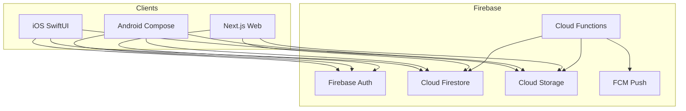
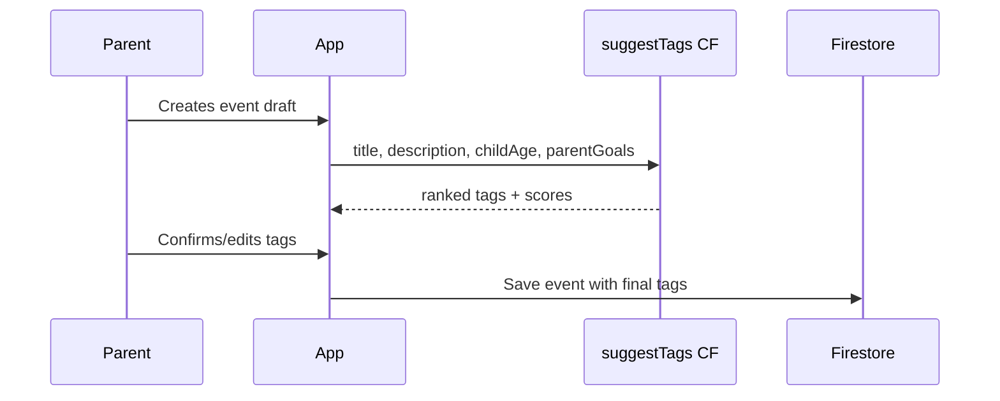
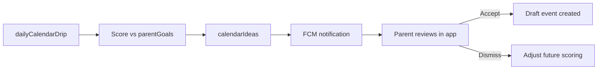

# Recess — Partiful for Kids with Brain Development Edge

> Build Recess — a Partiful-style platform for parents that combines social event invites and enrichment activity discovery, powered by brain-development tags, video reviews, and a calendar that drips personalized activity ideas. Firebase backs native Swift, Kotlin, and a Next.js web app.

## Product vision

Recess helps parents plan and discover kid-friendly events with a developmental lens. Unlike generic invite tools, every event carries **brain-development tags** tailored to the parent's goals (holistic, STEM-heavy, creative, social-emotional, etc.). Parents can **share short video reviews** of activities they've tried, and a **calendar drip** surfaces one personalized idea at a time so planning feels light, not overwhelming.



---

## Monorepo structure

```
Recess/
├── firebase/                 # rules, indexes, Cloud Functions, extensions
├── shared/                   # tag taxonomy, JSON schemas, API contracts
├── web/                      # Next.js — invite links, RSVP, discovery, reviews
├── ios/Recess/               # SwiftUI app
├── android/                  # Kotlin + Jetpack Compose
└── docs/                     # product + data model reference
```

The web app is critical for Partiful parity: shareable invite URLs (`recess.app/e/{slug}`) let guests RSVP without installing the app.

---

## Core data model (Firestore)

| Collection | Purpose |
|---|---|
| `users` | Parent profile, notification prefs |
| `children` | Child name, DOB/age, interests (subcollection of `users/{uid}`) |
| `parentGoals` | Development approach weights (subcollection of `users/{uid}`) |
| `events` | Social + enrichment events (host, title, time, location, type, tags) |
| `rsvps` | Guest responses (subcollection of `events/{id}`) |
| `videoReviews` | Short clips linked to events + optional child age context |
| `calendarIdeas` | Drip suggestions queued per child |
| `savedEvents` | Bookmarked enrichment activities |

**Event document (essential fields):**

```typescript
{
  type: "social" | "enrichment",
  hostId: string,
  title: string,
  startsAt: Timestamp,
  location: { name, lat?, lng? },
  description: string,
  tags: TagId[],           // brain-dev tags (auto-suggested + parent-edited)
  tagScores: Record<TagId, number>,  // confidence from suggestion engine
  visibility: "private" | "friends" | "public",
  inviteSlug: string,      // for web RSVP links
  childIds?: string[],     // which children this event is for
}
```

---

## Brain development tag system

### Tag taxonomy (seed in `shared/tags.json`)

| Tag | Examples |
|---|---|
| `stem` | Science museum, coding camp, building blocks |
| `creative_arts` | Painting, music, drama |
| `social_emotional` | Playdates, cooperative games, empathy activities |
| `physical_motor` | Sports, dance, playground, fine-motor crafts |
| `language_literacy` | Story time, journaling, word games |
| `nature_outdoors` | Hikes, gardening, park exploration |
| `sensory` | Sand/water play, textures, calm-down activities |
| `executive_function` | Puzzles, planning games, structured challenges |

### Parent goal profiles (onboarding quiz)

Parents pick an approach or customize weights:

- **Holistic** — balanced weights across all tags
- **STEM Explorer** — high `stem` + `executive_function`
- **Creative Soul** — high `creative_arts` + `sensory`
- **Social Butterfly** — high `social_emotional` + `physical_motor`
- **Custom** — slider per tag (0–100)

### Tag suggestion engine (MVP: rule-based Cloud Function)

`firebase/functions/src/suggestTags.ts` — callable function:

**Inputs:** event title/description, event type, child age, `parentGoals` weights  
**Logic (MVP):** keyword matching + age-based boosts + parent goal weighting  
**Output:** ranked tags with scores; parent confirms/edits before publish

**Phase 2:** Gemini via Firebase AI Logic for richer suggestions from free-text descriptions.



---

## Feature modules

### 1. Social events (Partiful parity)

- Create invite with theme, date/time, location, guest list
- Auto-suggest brain-dev tags from event description
- Generate shareable web link + deep link into native apps
- RSVP flow: Yes / No / Maybe + optional note
- Co-host support (Phase 2)

**Web-first flows** in `web/`:
- `/e/[slug]` — public invite + RSVP (no account required for guests)
- `/discover` — browse public enrichment events by tag (Phase 2)

### 2. Enrichment discovery

- Curated + user-created `enrichment` events surfaced by tag filters
- "Matches [Child]'s goals" badge when tag overlap exceeds threshold
- Save/bookmark for later; one-tap "Add to calendar drip"

### 3. Video reviews

- Record or upload **30–90 second** clips post-event
- Stored in Firebase Storage: `reviews/{eventId}/{reviewId}.mp4`
- Cloud Function generates thumbnail on upload
- Playback in event detail + discovery feed
- Optional: tag which child attended (age context shown to other parents)
- Security rules: only authenticated parents; max file size enforced

### 4. Calendar trickle

**Concept:** Instead of dumping a list of 50 ideas, Recess adds **one idea per day/week** to each child's calendar based on goals, age, and season.

**Implementation:**
- Scheduled Cloud Function (`dailyCalendarDrip`) runs nightly
- Picks from: template library + public enrichment events + past highly-reviewed events
- Scores candidates against `parentGoals` + child age band
- Writes to `calendarIdeas` with `status: pending | accepted | dismissed`
- Push notification: "Tuesday idea for Maya: Nature scavenger hunt"
- Parent taps **Accept** → pre-fills a draft social event or saves to wishlist
- Parent taps **Dismiss** → feedback improves future suggestions



---

## Platform-specific notes

### iOS (`ios/`)
- SwiftUI + MVVM
- Firebase iOS SDK (Auth, Firestore, Storage)
- `AVFoundation` for in-app video recording
- Sign in with Apple + Google

### Android (`android/`)
- Jetpack Compose + ViewModel
- Firebase Android SDK
- CameraX for video capture
- Google Sign-In

### Web (`web/`)
- Next.js 15 App Router
- Firebase JS SDK (client) for auth + Firestore reads
- Server components for SEO-friendly invite pages
- Mobile-responsive RSVP (most guests will open on phone)

### Shared contracts (`shared/`)
- Tag taxonomy JSON
- TypeScript types exported for web; generate Swift/Kotlin stubs manually or via quick scripts
- Keeps all three clients aligned on field names and enums

---

## Security (Firestore rules sketch)

- `users`, `children`, `parentGoals`: read/write only by owning `uid`
- `events`: host can write; readable based on `visibility`
- `rsvps`: guests can create their own; host can read all
- `videoReviews`: authenticated write; public read if linked event is public
- `calendarIdeas`: read/write only by parent `uid`

Storage rules: video uploads limited to authenticated users, max 50MB, path must match `reviews/{eventId}/`.

---

## Phased delivery

### Phase 1 — Foundation + social invites (MVP)
- Firebase project init, Auth, Firestore, Storage, Functions
- Monorepo scaffold (all 4 targets)
- Parent onboarding: account, child profile, goal quiz
- Create social event with tag suggestions
- Web RSVP page at `/e/[slug]`
- Basic iOS + Android: auth, create event, view RSVPs

### Phase 2 — Calendar trickle + discovery
- `dailyCalendarDrip` Cloud Function + FCM
- Calendar UI on all platforms (month view + idea cards)
- Enrichment event browse/filter by tag
- "Matches your goals" scoring badge

### Phase 3 — Video reviews + polish
- Video record/upload + thumbnail generation
- Review feed on event pages
- Discovery feed sorted by tag + review rating
- Gemini-powered tag suggestions (upgrade from rules)

---

## Key technical decisions

| Decision | Choice | Rationale |
|---|---|---|
| Backend | Firebase | Great for auth, real-time RSVPs, video storage, push |
| Web framework | Next.js | SEO invite pages, fast RSVP, shared Firebase SDK |
| Tag engine MVP | Rule-based CF | Ship fast; upgrade to AI when descriptions are richer |
| Calendar drip cadence | 1 idea / child / day (configurable) | "Trickle" feel; avoids overwhelm |
| Guest RSVP | Web-only, no account | Partiful-style low friction |
| Mobile | Native Swift + Kotlin | iOS and Android native apps |
| Platforms | iOS, Android, Web | All three share one Firebase backend |

---

## Implementation todos

- [ ] Initialize Firebase project, Firestore schema, security rules, and Cloud Functions scaffold
- [ ] Define brain-development tag taxonomy and parent goal profiles in `shared/tags.json` + TypeScript types
- [ ] Scaffold monorepo: `firebase/`, `shared/`, `web/` (Next.js), `ios/` (SwiftUI), `android/` (Compose)
- [ ] Build parent auth + child profile + goal quiz flow on iOS, Android, and web
- [ ] Implement event creation with tag suggestion CF, Firestore CRUD, and web RSVP page at `/e/[slug]`
- [ ] Build `dailyCalendarDrip` Cloud Function, `calendarIdeas` collection, calendar UI, and FCM notifications
- [ ] Add enrichment browse/filter by tags with goal-match scoring badge
- [ ] Implement video record/upload, thumbnail CF, review playback feed, and Storage security rules

---

## Prerequisites before implementation

1. Create Firebase project (or provide existing project ID)
2. Apple Developer + Google Play accounts (for native auth providers)
3. Domain for web invite links (e.g. `recess.app` or staging subdomain)

---

## Risks and mitigations

- **Three native codebases = slower iteration** — ship web RSVP + one mobile platform first if needed; shared Firestore schema keeps clients in sync
- **Video storage costs** — enforce 90s max, compress on upload, lazy-load in feeds
- **Tag quality at MVP** — rule-based engine will miss nuance; parent always edits before publish; Gemini upgrade in Phase 3
- **Calendar drip fatigue** — default to 3–4 ideas/week, not daily; let parents tune cadence in settings
