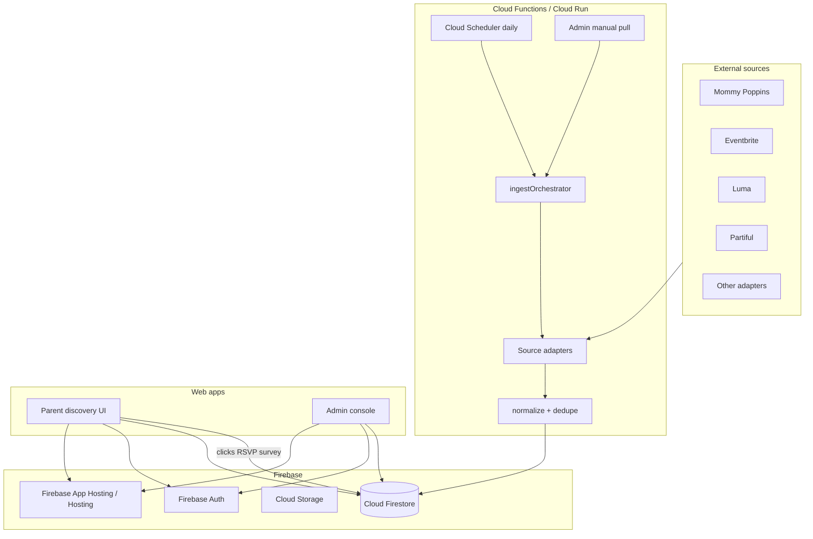
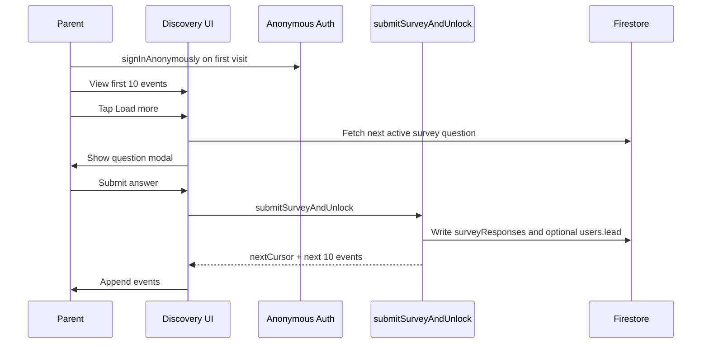
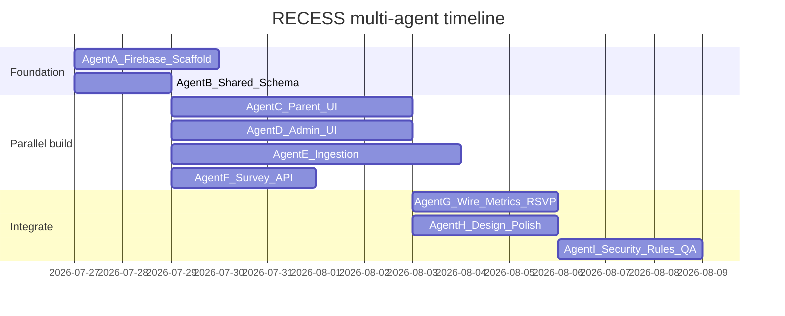

# RECESS — Multi-Agent Build Plan (Firebase)

> **Luma for kids and their parents.** A vibrant discovery feed of nearby kid events, gated learning surveys, and an admin console that runs the scrapers that keep the feed full.

---

## Product vision (v2 — this plan)

RECESS is three surfaces:

1. **Parent web (public)** — A fun, bold event list near you. Filter by location, event type, age group, and business name. Show **10 events**, then require a short survey answer to **Load more**.
2. **Admin console** — See every event, ratings, clicks, RSVPs. Create survey questions and review responses. Manually trigger scrapers or change how often they run.
3. **Ingestion cloud jobs** — Daily (and on-demand) pullers for Mommy Poppins, Eventbrite, Luma, Partiful, and more. Normalize into Firestore. Deduplicate. Serve through filters.

**Out of scope for this MVP** (parked from the old plan): Snap Map, org boost marketplace, friend graphs, event chat/albums, video reviews, calendar drip, native mobile apps. Revisit after the feed + survey + admin loop works.

---

## Locked decisions (2026-07-26)

| Decision | Choice |
|---|---|
| Firebase project | **`recess-app-nyc`** (display name RECESS) — created, billing linked, Firestore `nam5`, web app registered |
| Console | https://console.firebase.google.com/project/recess-app-nyc/overview |
| Parent auth | **Anonymous** Firebase Auth (enabled + verified via `accounts:signUp`) |
| Lead capture | First Load-more survey can collect **name + email + zip** (structured question type `lead_capture`) |
| Launch metros | **NYC**, **Scarsdale/Bronxville**, **Chappaqua** |
| Ingestion design | See **[`SCRAPERS.md`](./SCRAPERS.md)** — live-probed; MP + Eventbrite first |
| Billing account | **Personal** (`01D2CC-0FDF3E-487733`) — confirmed OK for now |
| Admin logins | Email/password Auth enabled. Seed admins in `admins/{uid}`: `byonedegree@gmail.com` (`wQsA2zBaOIOrBi661EXJEOdmrJs1`), `recessplsyes@gmail.com` (`jwmlu3rIgvPovb8QErW2E4AWU3K2`) |



---

## Brand & UI direction

**Name:** RECESS  
**Vibe:** Playground energy — loud joy, soft safety. Think Luma’s clean invite clarity, but for families: bouncy type, saturated color, big rounded corners, zero corporate beige.

| Token | Direction |
|---|---|
| Display font | Bold rounded sans (e.g. **Nunito / Fredoka / Rounded** via Google Fonts) — RECESS wordmark is the hero signal |
| Body font | Soft rounded sans companion |
| Palette | Sunshine yellow, playground red, sky blue, grass green on a warm off-white with subtle confetti / scribble texture — **not** purple-indigo AI defaults, not cream+terracotta, not broadsheet |
| Motion | 2–3 intentional motions: logo pop on load, filter chips bounce, load-more survey slide-up |
| Layout | One job per section. First viewport = **RECESS** + one line + filters + feed. No card clutter in the hero. Event rows can be playful list items, not dense dashboards |

**Brand test:** Remove the nav — the page should still scream RECESS.

---

## Firebase stack

| Layer | Choice | Why |
|---|---|---|
| App | Next.js (App Router) on **Firebase App Hosting** | SSR-friendly filters, one deploy target for parent + admin |
| Auth | Firebase Auth | Anonymous or email for parents (RSVP/survey attribution); Google/email for admins |
| DB | Cloud Firestore | Events, metrics, surveys, ingest runs |
| Jobs | Cloud Functions (2nd gen) + **Cloud Scheduler**; heavy scrapers on **Cloud Run** if Playwright needed | Daily cron + callable manual trigger from admin |
| Secrets | Google Secret Manager | API keys, scrape credentials |
| Analytics (product) | First-party counters in Firestore + optional GA4 | Clicks / RSVPs owned in-app for admin views |
| Storage | Cloud Storage | Optional event images / org logos later |

**Project:** Use `recess-app-nyc` (already created). Web SDK values live in `.env.example`.

---

## Core user flows

### Parent — discover

1. Land on RECESS. Geolocation (or city picker) sets location filter.
2. Optional filters: event type, age group, business name (text search).
3. See **page of 10** upcoming events sorted by soonest / nearest.
4. Tap event → detail (description, org, age, when/where, outbound link). Increment `clickCount`.
5. RSVP (interested / going) → write `rsvps` + increment counters.
6. **Load more** → modal with one active survey question → submit answer → unlock next 10.

### Admin — operate

1. Sign in as `admin`.
2. Events table: title, source, date, location, rating avg, clicks, RSVPs, status.
3. Ingestion panel: last run per source, schedule cron expression, **Run now**, pause/resume source.
4. Surveys: create/edit questions, activate one (or weighted pool), view response aggregates + raw answers.

---

## Data model (Firestore)

### `events/{eventId}`

```typescript
{
  title: string
  organization: string          // business / host name
  eventType: string             // class | park | museum | party | camp | other
  ageGroup: { min: number; max: number; label: string } // e.g. "3-5", "All ages"
  description: string
  links: { primary: string; tickets?: string; source?: string }
  phone?: string
  startsAt: Timestamp
  endsAt?: Timestamp
  timezone: string
  location: {
    name: string
    address: string
    city: string
    region: string
    country: string
    lat: number
    lng: number
    geohash: string
  }
  source: {
    platform: "mommy_poppins" | "eventbrite" | "luma" | "partiful" | "manual" | string
    externalId: string
    sourceUrl: string
    lastIngestedAt: Timestamp
  }
  fingerprint: string           // dedupe key
  status: "active" | "hidden" | "ended"
  metrics: {
    clickCount: number
    rsvpCount: number
    ratingAverage: number
    ratingCount: number
  }
  createdAt: Timestamp
  updatedAt: Timestamp
}
```

**Indexes (composite):**  
`(status, startsAt)`, `(status, eventType, startsAt)`, `(status, organization, startsAt)`, location queries via geohash prefix + client/server radius filter.

### `rsvps/{rsvpId}` or `events/{eventId}/rsvps/{uid}`

```typescript
{
  eventId: string
  userId: string               // auth uid or anonymous id
  status: "interested" | "going" | "cancelled"
  createdAt: Timestamp
}
```

### `eventClicks/{clickId}` (optional append-only) + denormalized `metrics.clickCount`

### `ratings/{ratingId}` or `events/{eventId}/ratings/{uid}`

```typescript
{
  eventId: string
  userId: string
  stars: 1 | 2 | 3 | 4 | 5
  comment?: string
  createdAt: Timestamp
}
```

### `surveyQuestions/{questionId}`

```typescript
{
  prompt: string
  type: "single_choice" | "multi_choice" | "text" | "scale" | "lead_capture"
  options?: string[]
  active: boolean
  weight: number               // for random pool
  createdAt: Timestamp
  createdBy: string
}
```

### `surveyResponses/{responseId}`

```typescript
{
  questionId: string
  answer: string | string[] | number
  userId: string
  sessionId: string
  filtersSnapshot?: { location?: string; eventType?: string; ageGroup?: string; businessName?: string }
  createdAt: Timestamp
  unlockedPage: number         // which "load more" page this unlocked
}
```

### `ingestSources/{sourceId}`

```typescript
{
  platform: string
  enabled: boolean
  scheduleCron: string         // e.g. "0 7 * * *"
  metros: string[]             // e.g. ["nyc", "la"]
  lastRunAt?: Timestamp
  lastRunStatus?: "success" | "partial" | "failed"
  config: Record<string, unknown>
}
```

### `ingestRuns/{runId}`

```typescript
{
  sourceId: string
  trigger: "schedule" | "manual"
  startedAt: Timestamp
  finishedAt?: Timestamp
  status: "running" | "success" | "partial" | "failed"
  stats: { fetched: number; upserted: number; skipped: number; errors: number }
  errorSummary?: string
}
```

### `admins/{uid}`

```typescript
{ role: "admin"; email: string }
```

---

## Cloud functions & jobs

| Function | Trigger | Responsibility |
|---|---|---|
| `ingestOrchestrator` | HTTPS callable (admin) + Pub/Sub from Scheduler | Fan out enabled sources / metros |
| `ingestMommyPoppins` | Pub/Sub topic | Adapter → normalize → upsert |
| `ingestEventbrite` | Pub/Sub | Prefer official API; fall back scrape only if needed |
| `ingestLuma` | Pub/Sub | Adapter |
| `ingestPartiful` | Pub/Sub | Adapter |
| `queryEvents` | HTTPS / callable | Filtered page of 10, cursor pagination |
| `recordClick` | Callable | Auth-aware click + metrics bump |
| `rsvpEvent` | Callable | Upsert RSVP + metrics |
| `submitSurveyAndUnlock` | Callable | Validate answer, write response, return next page token |
| `adminSetSourceSchedule` | Callable | Update `ingestSources` + Scheduler job |
| `adminTriggerIngest` | Callable | Manual pull now |
| `aggregateRatings` | Firestore onWrite | Keep `metrics.ratingAverage` |

**Ingestion contract (every adapter returns):**

```typescript
type NormalizedEvent = {
  externalId: string
  platform: string
  title: string
  organization: string
  eventType: string
  ageGroup: { min: number; max: number; label: string }
  description: string
  links: { primary: string; tickets?: string; source?: string }
  phone?: string
  startsAt: Date
  endsAt?: Date
  timezone: string
  location: { name: string; address: string; city: string; region: string; country: string; lat: number; lng: number }
}
```

**Dedupe:** `fingerprint = hash(normalize(title) + startsAtISO + round(lat,3) + round(lng,3) + platform|cross)`. Cross-source merge prefers richer description / better geo.

**Legal / ops note:** Eventbrite public search API is dead — use discovery HTML JSON per SCRAPERS.md. Prefer stable public JSON where it exists (Luma discover). Scrapers must be respectful (rate limits, robots, ToS). Store `sourceUrl` and never claim ownership of third-party content.

---

## Survey gate (Load more)



Rules:
- First page is free (no survey). Anonymous auth still runs so clicks/RSVPs/surveys attach to a `uid`.
- Each additional page requires **one** answered question (from active pool).
- **Seed question #1 (`lead_capture`):** name, email, zip — unlocks the first Load more. Store on `surveyResponses` and mirror to `users/{uid}.lead`.
- Later questions: kids' ages, preferred event types, etc.
- Same session can be rate-limited (e.g. max unlocks/hour) to reduce spam.
- Admin can rotate questions without redeploying the client.

### `surveyQuestions` type addition

```typescript
type: "single_choice" | "multi_choice" | "text" | "scale" | "lead_capture"
// lead_capture client fields: name (required), email (required), zip (required)
```

---

## Monorepo layout

```
Recess/
├── PLAN.md
├── SCRAPERS.md                  # live-probed ingestion architecture
├── PRODUCT_VISION_AND_FEATURES.txt
├── apps/
│   └── web/                      # Next.js — parent + /admin
│       ├── app/(parent)/
│       ├── app/admin/
│       ├── components/
│       └── lib/firebase/
├── packages/
│   └── shared/                   # types, zod schemas, eventType enums
├── functions/                    # Firebase Cloud Functions
│   └── src/
│       ├── ingest/
│       ├── events/
│       ├── survey/
│       └── admin/
├── ingestion/                    # Optional Cloud Run Playwright workers
│   ├── Dockerfile
│   └── src/adapters/
├── firebase.json
├── firestore.rules
├── firestore.indexes.json
└── storage.rules
```

---

## Multi-agent plan

Work is split into **agents** with clear ownership, inputs, and definition of done. Agents can run in parallel when their dependencies are green.



### Agent A — Firebase foundation

**Owns:** Project wiring, Hosting/App Hosting, Functions bootstrap, Auth, emulator config.

**Does:**
- Confirm/create Firebase project (`recess-dev` / `recess-prod`)
- `firebase.json`, emulators, App Hosting for Next.js
- Admin custom claims or `admins/{uid}` bootstrap
- CI deploy scripts (preview + prod)

**Done when:** `npx -y firebase-tools@latest emulators:start` runs; empty Next app deploys to a preview URL.

**Blocks:** Everyone needs project IDs + env template (`.env.example`).

---

### Agent B — Shared schema & rules skeleton

**Owns:** `packages/shared`, Zod types, Firestore collection contracts, index definitions.

**Does:**
- Types for Event, Survey*, Ingest*, RSVP, Rating
- `firestore.indexes.json` composites
- Draft `firestore.rules` (public read active events; writes via Functions only for metrics/survey; admin-only for sources/questions)

**Done when:** Shared package builds; other agents import types without inventing fields.

**Handoff artifact:** `packages/shared/src/schema.ts`

---

### Agent C — Parent discovery UI

**Owns:** Public RECESS experience — brand, filters, list, detail, load-more gate shell.

**Does:**
- Brand system (CSS variables, fonts, motion)
- Filters: location, event type, age group, business name
- Event list (10) + empty/loading states
- Event detail sheet/page
- Load-more CTA → survey modal UI (wired to Agent F)
- Responsive desktop + mobile

**Done when:** UI works against emulator seed data; RECESS brand passes the “nav removed” test.

**Does not:** Scraper logic, admin screens.

---

### Agent D — Admin console

**Owns:** `/admin` — ops dashboard.

**Does:**
- Auth gate (admin only)
- Events table with metrics columns
- Ingestion controls: schedule edit, enable/disable source, Run now, run history
- Survey question CRUD + response explorer (charts + table)

**Done when:** Admin can manage questions and trigger a mock ingest against emulators.

---

### Agent E — Ingestion pipeline

**Owns:** Adapters + orchestrator + Cloud Run (if needed). **Follow [`SCRAPERS.md`](./SCRAPERS.md) exactly.**

**Order of adapters (MVP) — revised after live probes:**
1. **Mommy Poppins** (Cheerio list + JSON-LD detail; regions `118` NYC, `120` Westchester)
2. **Eventbrite** (parse `window.__SERVER_DATA__` on `/d/{place}/kids/` — official search API is dead)
3. **Luma** (`api.luma.com/discover/get-paginated-events` — official Plus API is owner-only)
4. **Partiful** (`__NEXT_DATA__` on `/explore/nyc` + geo filter + strict kid filter)
5. Stub manual JSON import for seeding

**Metros:** `nyc`, `scarsdale_bronxville`, `chappaqua` (centers in SCRAPERS.md).

**Does:**
- `ingestOrchestrator` + per-source workers
- Normalize → fingerprint → upsert + `metroIds[]`
- `ingestRuns` logging
- Scheduler jobs per source (configurable; default daily 7am ET)
- Kid-relevance filter (critical for Luma/Partiful)

**Done when:** Manual trigger pulls MP + Eventbrite into Firestore for all three metros; daily schedule documented; failures visible in `ingestRuns`.

**Risk:** Site HTML changes break scrapers — isolate selectors per adapter; alert on `fetched == 0`.

---

### Agent F — Survey + pagination API

**Owns:** Callable functions that enforce the learning loop.

**Does:**
- `queryEvents` with filters + cursor (page size 10)
- Active question picker
- `submitSurveyAndUnlock` (answer required → next page)
- Session / rate-limit guards

**Done when:** Integration test: page1 free → load more blocked → answer → page2 returned.

---

### Agent G — Engagement metrics

**Owns:** Clicks, RSVPs, ratings aggregation.

**Does:**
- `recordClick`, `rsvpEvent`, ratings write path
- Denormalized counters on `events.metrics`
- Admin reads those counters (no separate warehouse for MVP)

**Done when:** Clicking / RSVPing in parent UI increments numbers visible in admin within seconds.

---

### Agent H — Design polish (RECESS vibe)

**Owns:** Visual QA pass after Agent C’s structure exists.

**Does:**
- Typography scale, color tokens, illustration/texture
- Micro-interactions (filter chips, survey sheet, load-more celebration)
- Accessibility: contrast, focus rings, reduced-motion fallback

**Done when:** Landing + feed feel like a product kids’ parents would screenshot — fun, not cluttered.

---

### Agent I — Security, rules, QA

**Owns:** Hardening before public traffic.

**Does:**
- Lock Firestore rules (no client writes to metrics/events)
- Admin IAM verification
- Abuse tests on survey unlock
- Seed script + smoke checklist
- Scraper ToS / rate-limit review notes

**Done when:** Rules tests pass; checklist signed off for launch city.

---

## Agent communication contract

All agents share:

1. **Schema package** from Agent B — never fork field names.
2. **Env template** from Agent A — `NEXT_PUBLIC_FIREBASE_*`, function regions.
3. **Emulator seed** — `scripts/seed.ts` with 30 fake events + 3 survey questions so C/D/F can parallelize without live scrapers.
4. **PR discipline** — one agent ≈ one PR stream; merge foundation (A+B) first.

---

## MVP acceptance criteria

- [ ] Parent can filter events by location, type, age, business name
- [ ] Exactly 10 events per page; Load more requires survey answer
- [ ] Survey answers land in Firestore and show in admin
- [ ] Admin sees clicks, RSVPs, rating aggregates per event
- [ ] Admin can create/activate survey questions
- [ ] Admin can change ingest schedule and click **Run now**
- [ ] At least two external sources ingest successfully into `events`
- [ ] RECESS UI is bold, rounded, vibrant, brand-first
- [ ] Deployed on Firebase (dev + prod projects)

---

## Suggested launch slice

**Week 1:** Agents A + B + seed data  
**Week 2:** Agents C + F + H (parent loop with fake events)  
**Week 3:** Agents D + G (admin + metrics)  
**Week 4:** Agent E (real ingestion) + Agent I (security) → soft launch one metro  

---

## Remaining open decisions

1. **Hosting:** Firebase App Hosting (recommended for Next.js) vs Hosting + Cloud Functions SSR?

---

## What this replaces

This document supersedes the previous Partiful + Snap Map + boost marketplace + community plan as the **active build target**. Prior ideas remain useful backlog, not MVP scope.

**Scraper source of truth:** [`SCRAPERS.md`](./SCRAPERS.md)
