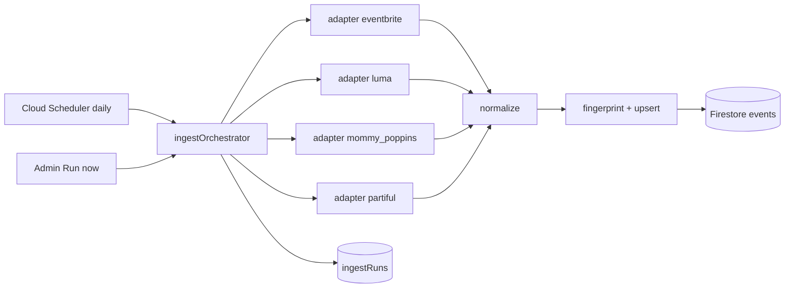

# RECESS Ingestion / Scraper Architecture

Live-probed against production sources on **2026-07-26**. Build adapters from this document — do not assume official public search APIs exist.

## Launch metros (geo targets)

| Metro ID | Label | Center (approx) | Notes |
|---|---|---|---|
| `nyc` | New York City | `40.7128, -74.0060` | Primary volume |
| `scarsdale_bronxville` | Scarsdale / Bronxville | `40.9420, -73.8070` | Westchester south |
| `chappaqua` | Chappaqua | `41.1595, -73.7649` | Westchester north |

Query strategy:
- Pull by **source-native region** when available (MP Westchester, EB place slugs, Luma `slug=nyc` + lat/lng).
- After normalize, **bucket** into metros by distance to metro centers (or city/zip match).
- An event can appear in more than one metro if near a boundary; store `metroIds: string[]`.

---

## Shared pipeline



**Runtime:** Cloud Functions 2nd gen for HTTP/JSON adapters (Luma, Eventbrite HTML JSON, Partiful `__NEXT_DATA__`). Prefer **Cloud Run + Playwright** only if a source starts requiring a real browser (Mommy Poppins is HTML today; keep Cheerio-first).

**Normalize contract** → see `PLAN.md` `NormalizedEvent`.

**Kid relevance filter (post-normalize):**
- Keep if age group present and max age ≤ 18, OR
- Eventbrite tags include Family / Children & Youth, OR
- Title/description matches kid keywords (storytime, kids, family, toddler, camp, playground…), OR
- Source is Mommy Poppins (already family-curated).
- Drop nightlife / 21+ unless explicitly family.

**Respectful crawl:**
- Max concurrency 2 per source; 1–2s delay between detail pages.
- Cache list pages 6h; detail pages 24h unless admin force-refresh.
- Always store `sourceUrl` + `lastIngestedAt`; never rewrite outbound booking links.
- Every run writes a rich doc to `ingestRuns/{runId}` (status, per-source counts, sample titles, skip reasons, log lines). Review in Admin → **Scraper history**.
- Alert / refine when `stats.fetched == 0` or status is `failed` / `partial`.

---

## 1. Eventbrite — HTML discovery JSON (not the official Search API)

### Reality check
Official **Event Search API was shut down in 2019**. Org-scoped API cannot discover public city events. We scrape Eventbrite’s **public discovery pages**, which embed structured JSON.

### List URL pattern
```
https://www.eventbrite.com/d/{place}/{category}/
```
MVP seeds:
| Metro | Place slug | Category |
|---|---|---|
| NYC | `ny--new-york` | `kids` (+ `family-and-education`) |
| Scarsdale/Bronxville | `ny--white-plains` or `ny--scarsdale` | `kids` |
| Chappaqua | `ny--chappaqua` / nearby Westchester place | `kids` |

Paginate with `?page=N` while `page_count` allows.

### Extraction (verified)
1. GET list HTML (`User-Agent` browser-like).
2. Parse `window.__SERVER_DATA__ = {...}`.
3. Read `search_data.events.results[]`.

**Verified fields on each result:**
| Field | Use |
|---|---|
| `id` / `eventbrite_event_id` | `externalId` |
| `name` | title |
| `summary` / `full_description` | description |
| `start_date` + `start_time` + `timezone` | startsAt |
| `end_date` + `end_time` | endsAt |
| `url` | links.primary |
| `primary_venue.name` + `address.*` | location |
| `tags[].display_name` | eventType + age hints (`Children & Youth`, `Family & Education`, `Class, Training, or Workshop`) |

Fallback: `application/ld+json` ItemList / Event nodes on the same page (also verified).

### Adapter outline
```
ingestEventbrite(metroId):
  for url in seedUrls(metroId):
    html = fetch(url)
    data = parseServerData(html)
    for raw in data.search_data.events.results:
      yield mapEventbrite(raw)
```

**No API key required** for public discovery HTML.

---

## 2. Luma — public discover JSON API (best source)

### Reality check
Official `public-api.luma.com` is **calendar-owner / Luma Plus** only — useless for city-wide discovery. The web app’s **unauthenticated** discover API works:

```
GET https://api.luma.com/discover/get-paginated-events
  ?slug=nyc&pagination_limit=50
  &pagination_cursor=...
```

Lat/lng variant (verified for Chappaqua coords):
```
GET https://api.luma.com/discover/get-paginated-events
  ?latitude=41.1595&longitude=-73.7649&pagination_limit=50
```

### Verified response shape
```json
{
  "entries": [{
    "api_id": "evt-…",
    "event": {
      "api_id": "evt-…",
      "name": "…",
      "start_at": "ISO",
      "end_at": "ISO",
      "timezone": "America/New_York",
      "url": "shortslug",
      "cover_url": "…",
      "geo_address_info": { "city", "region", "address", "full_address", "latitude", "longitude" },
      "location_type": "offline|online|hybrid"
    },
    "calendar": { "name", "slug", "…" },
    "hosts": [{ "name", "…" }],
    "guest_count": 0,
    "ticket_info": { "is_paid": false }
  }],
  "has_more": true,
  "next_cursor": "…"
}
```

Map:
- `organization` ← `calendar.name` or first host name
- `links.primary` ← `https://luma.com/{event.url}`
- Description often missing on list → optional second fetch to event page / detail endpoint later

### Kid filter
Luma is adult-skewed. **Aggressive keyword + calendar-name filter** required before upsert. Prefer family/kids calendars when discoverable.

---

## 3. Mommy Poppins — Drupal HTML + JSON-LD (highest kid signal)

### Reality check
No public API. Drupal calendar with stable region IDs.

| Region | Calendar list URL |
|---|---|
| NYC | `https://mommypoppins.com/events/118/new-york-city/all/tag/all/age/{YYYY-MM-DD}/all/all/type/0/deals/0/near/all` |
| Westchester | `https://mommypoppins.com/events/120/westchester/all/tag/all/age/{YYYY-MM-DD}/all/all/type/0/deals/0/near/all` |
| Connecticut | `https://mommypoppins.com/events/114/connecticut/all/tag/all/age/{YYYY-MM-DD}/all/all/type/0/deals/0/near/all` |

The calendar is **day-scoped** (`age/{date}`). Adapter walks ~30 days per region. List cards include title, venue, and `<time datetime>` — do not rely only on `/event/` hrefs (many use `/…/event/events/…`).

### List extraction
Parse `.views-row` cards:
- `data-analytics-nid` → internal id
- `data-analytics-title` → title
- Link `href="/event/{slug}"` → detail URL

### Detail extraction (verified)
1. GET `https://mommypoppins.com/event/{slug}`
2. Parse `application/ld+json` `@graph` Event:
   - name, description, startDate, endDate
   - location.name + PostalAddress
   - offers.url / price
3. Supplement from HTML for **Age** (not in JSON-LD) and phone when present.

### Adapter outline
```
ingestMommyPoppins(regionId):
  cards = parseList(regionListUrl(regionId))
  for card in cards:
    detail = fetch(card.url)
    event = parseJsonLdEvent(detail) + parseAgeFromHtml(detail)
    yield mapMommyPoppins(event, card.nid)
```

**Priority adapter #1 for RECESS** — already family-curated.

---

## 4. Partiful — Next.js `__NEXT_DATA__` (public explore)

### Reality check
No official public API. Explore pages SSR event JSON into `__NEXT_DATA__`.

```
GET https://partiful.com/explore/nyc
```

Verified: `props.pageProps` contains `trendingSection`, `sections`, `feedItems` with ~70 event-like objects.

**Verified event fields:**
| Field | Use |
|---|---|
| `id` | externalId |
| `title` | title |
| `description` | description |
| `startDate` / `endDate` | times (ISO) |
| `timezone` | timezone |
| `locationInfo` | freeform / maps URL (geocode later) |
| `image.url` | cover |
| guest counts | optional social signal — not Recess RSVP |

Canonical URL: `https://partiful.com/e/{id}`

### Metro coverage
Partiful explore is **city-region** (`nyc`). For Scarsdale/Bronxville/Chappaqua: ingest NYC feed, then **geo-filter** events whose resolved lat/lng fall inside Westchester metros (geocode `locationInfo` when possible). Many Partiful events are adult social — apply strict kid filter or tag as `needs_review`.

### Adapter outline
```
ingestPartiful(region='nyc'):
  html = fetch('https://partiful.com/explore/nyc')
  props = parseNextData(html).props.pageProps
  for raw in collectEvents(props):
    if kidRelevant(raw): yield mapPartiful(raw)
```

Optional later: reverse-engineer Partiful feed XHR for pagination beyond SSR payload.

---

## Adapter priority for Agent E

| Order | Source | Method | Kid quality | Fragility |
|---|---|---|---|---|
| 1 | Mommy Poppins | Cheerio list + JSON-LD detail | Excellent | Medium (Drupal markup) |
| 2 | Eventbrite | `__SERVER_DATA__` on `/d/.../kids/` | Strong with category seed | Medium |
| 3 | Luma | `api.luma.com/discover/...` | Weak without filter | Low (stable JSON) |
| 4 | Partiful | `__NEXT_DATA__` explore | Weak without filter | Medium-High |

Ship **MP + Eventbrite** before polish on Luma/Partiful filters.

---

## Admin controls (`ingestSources` — configurable, no redeploy)

Admins create named pulls in Firestore (UI chips). One catch-all callable reads these docs.

```typescript
{
  name: "Mommy Poppins NYC",          // chip + log label
  url: "https://mommypoppins.com/events/118/...",
  adapter: "auto" | "mommy_poppins" | "eventbrite" | "luma" | "partiful" | "generic",
  enabled: true,
  days: 30,                           // MP day-walk
  maxDetails: 120,
  metroIds: ["nyc"],
}
```

- `adapter: "auto"` → detect from hostname (`mommypoppins.com`, `eventbrite.com`, …).
- Unknown hosts → **generic** JSON-LD Event scraper (best-effort for new sites).
- Admin chips call `adminTriggerIngest({ sourceId })` or `{ sourceId: "all" }`.
- Daily `scheduledIngest` runs every enabled source.

---

## Legal / product stance

- Prefer public pages / discover endpoints meant for browsers.
- Attribute source in UI (“Found on Mommy Poppins”) and deep-link out for tickets.
- Do not store or re-serve copyrighted full article bodies beyond event listing fields needed for discovery.
- If a source blocks us (403/CF), pause that adapter in admin and alert — do not escalate to evasive scraping in MVP.
